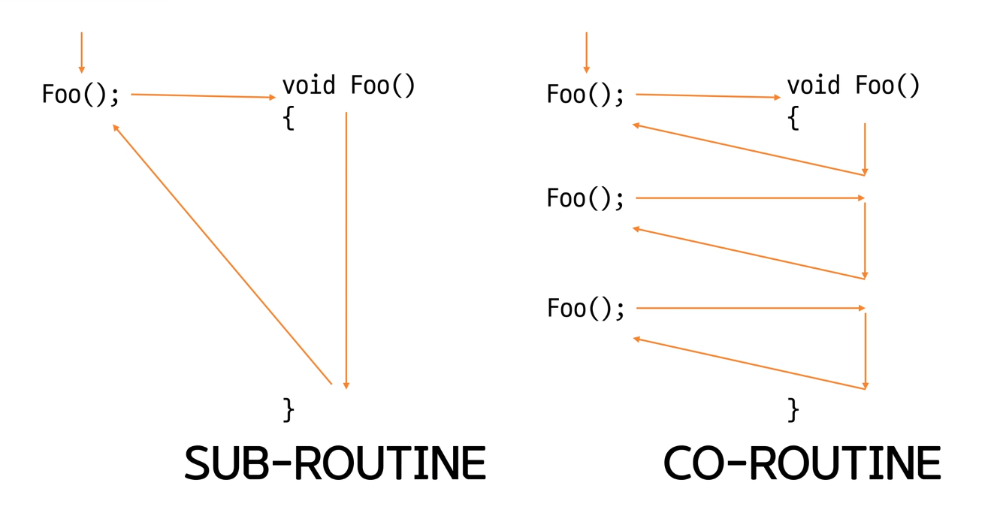
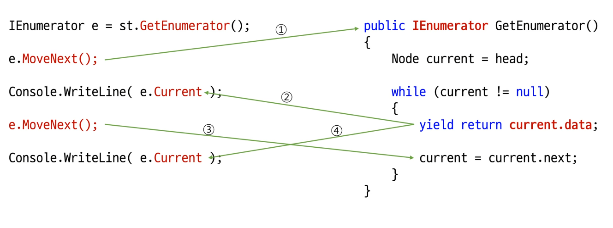

# 목차

---

<br>

# Coroutine이란?

일반적으로 함수 호출은 함수의 본문이 끝난 뒤에 호출한 공간으로 이동한다.

    SUB_ROUTINE

하지만 코루틴은 실행 분기를 조절 할 수 있다.

    ex) 일부 실행후 호출한 곳으로 이동

    CO_ROUTINE (대등하게 동작)



<br>

## C# 과 Coroutine

- C# 에서는 Coroutine을 완벽하게 지원하지는 않는다.

- Collection의 열거자를 만들때 일부 지원한다.

- LINQ등이 Coroutine 개념을 사용하여 작성되어 있음.

<br>

## Corutine과 Enumerator

모든 컬렉션은 열거자를 반환 할 수 있어야 한다.

- 컬렉션 자신만의 `열거자 타입을 설계` 해야 한다.

Corutine을 사용한 열거자 만들기

- 별도의 열거자 타입이 필요 없다.

- GetEnumerator()에서 "컬렉션이 가진 모든 요소에 대해 yield retrun 수행"

```C#
public IEnumerator GetEnumerator()
{
    //return new 열거자

    Node current = head;

    while (current != null)
    {
        return current.data;

         current = current.next;
    }
}
```

이렇게 구현할 경우 문제

1. retrun Type이 틀리다 (int != IEnumerator)

2. while문을 한번만 돈다.

💡 해결
=> `return current.data;` 를 `yield return current.data;`로 변경한다.

(코드)[../Code/enumertor_Imp3.cs]

<br>



# Coroutine 생성법

1. 만드는 방법

   반환 타입을 아래의 4가지 중에 선택 해야함

   - Object타입 반환

     1. IEnumerator
     2. IEnumerable

   - T 타입 반환

     3. IEnumerator<T>
     4. IEnumerable<T>

   반환 방법 `yield retrun {반환값}`

2. 호출 방법

   메서드 호출 후 "열거자 참조 얻기"

   "{열거자}.MoveNext()"로 호출

   메서드가 `yield retrun`한 값은 `{열거자}.Current`를 통해 얻을 수 있다.

- SubRoutine

```C#
public static int Foo()
{
    Console.WriteLine("1"); return 10;
    //일반적으로 이 아래는 실행이 안됨.
    Console.WriteLine("2"); return 20;
    Console.WriteLine("3"); return 30;
    Console.WriteLine("4"); return 40;
    Console.WriteLine("5"); return 50;
}

public static void Main()
{
    int n1 = Foo();
    IEnumerator<int> e = Goo();
    IEnumerable<int> c = Hoo();
    IEnumerator<int> e2 = c.GetEnumerator();
    e.MoveNext();
    e2.MoveNext();
    Console.WriteLine($"SubRoutine {n1}");
    e.MoveNext();
    e2.MoveNext();
    Console.WriteLine($"SubRoutine {n1}");
}
```

- Corutine (열거자 인터페이스로 반환)

  일반적으로 이와 같이 구현함.

  ```C#
  //Coroutine - 열거자 인터페이스로 반환
  public static IEnumerator<int> Goo()
  {
      Console.WriteLine("1"); yield return 10;
      Console.WriteLine("2"); yield return 20;
      Console.WriteLine("3"); yield return 30;
      Console.WriteLine("4"); yield return 40;
      Console.WriteLine("5"); yield return 50;
  }

  public static void Main()
  {
      IEnumerator<int> e = Goo();
      e.MoveNext();
      Console.WriteLine($"Coroutine : {e.Current}");
      e.MoveNext();
      Console.WriteLine($"Coroutine : {e.Current}");
  }
  ```

- Coroutine - 컬렉션 인터페이스로 반환

  LINQ가 이렇게 함.

  ```C#
  //Coroutine - 컬렉션 인터페이스로 반환
  public static IEnumerable<int> Hoo()
  {
      Console.WriteLine("1"); yield return 10;
      Console.WriteLine("2"); yield return 20;
      Console.WriteLine("3"); yield return 30;
      Console.WriteLine("4"); yield return 40;
      Console.WriteLine("5"); yield return 50;
  }

  public static void Main()
  {
    IEnumerable<int> c = Hoo();
    IEnumerator<int> e2 = c.GetEnumerator();
    e2.MoveNext();
    Console.WriteLine($"Coroutine Collection {e2.Current}");

    e2.MoveNext();
    Console.WriteLine($"Coroutine Collection {e2.Current}");
  }
  ```

[코드]()