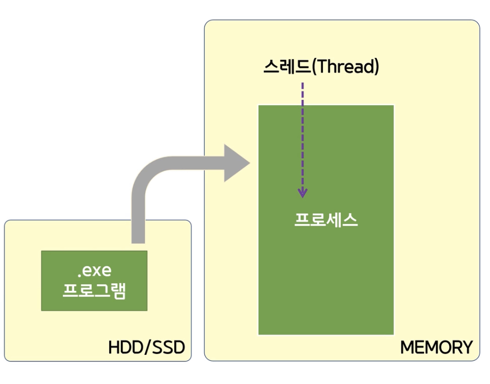

# ¸ñÂ÷

1. [# Thread](#-Thread)

   1-1. [## Thread ±âº» »ç¿ë](##-Thread-±âº»-»ç¿ë)

   1-2. [## Thread »ı¼º](##-Thread-»ı¼º)

   1-3. [## Thread Ŭ·¡½º ¸É¹ö](##-Thread-Ŭ·¡½º-¸É¹ö)

2. [# Task](#-Task)

---

# Thread

ÇÁ·Î±×·¥ÀÌ ½ÇÇàµÇ´Â ´ÜÀ§¸¦ ¾²·¡µå¶ó°í ÇÑ´Ù.

- Program (ÇÁ·Î±×·¥)

  Á¤ÀûÀÎ ÆÄÀÏ

- Process (ÇÁ·Î¼¼½º)

  ½ÇÇàµÇ°íÀÖ´Â ÇÁ·Î±×·¥

¾²·¡µå

    - ÇÁ·Î¼¼½ºÀÇ È帧 ´ÜÀ§

    - ºñµ¿±â·Î ÇÁ·Î±×·¥À» ½ÇÇàÇϱâ À§ÇØ »ç¿ëÇÑ´Ù.



## Thread ±âº» »ç¿ë

- Thread °´Ã¼ »ı¼º

- ThreadÀÇ Start() ¸Ş¼­µå È£Ãâ

```C#
using System;
using System.Threading;

class Program
{
    public static void Foo()
    {
        Console.WriteLine("Foo Start");
        Thread.Sleep(2000);
        Console.WriteLine("Foo End");
    }
    static void Main()
    {
        //Foo();          //ÁÖ Thread°¡ È£Ãâ

        //»õ·Î¿î Thread¸¦ ¸¸µé¾î ÁØ´Ù
        Thread t = new Thread(Program.Foo);
        //»õ·Î¿î Thread¿¡ ÀÛ¾÷ ÇÒ´ç
        t.Start();

        Console.WriteLine("Main Start");
        Thread.Sleep(2000);
        Console.WriteLine("Main End");
    }
}
```

ÀϹİÀûÀ¸·Î ½ÇÇàÇÏ°Ô µÇ¸é Foo Start - Foo End - Main Start - Main End¼øÀ¸·Î ºÒ¸°´Ù.

Thread »ı¼ºÇؼ­ ¸¸µé °æ¿ì Foo Start - Main Start - Foo End - Main End·Î ºÒ¸°´Ù.

## Thread »ı¼º

1. Thread »ı¼ºÀÚ

   Thread(ThreadStart start);
   Thread(ParameterizedThreadStart start);
   Thread(ThreadStart start, int maxStackSize);
   Thread(ParameterizedThreadStart start, int maxStackSize);

   delegate void ThreadStart();
   delegate void ParameterizedThreadStart(object obj);

2. ÀÎÀÚ Å¸ÀÔÀÌ objectÀ̰ųª ÀÎÀÚ°¡ ¾øÀ» °æ¿ì 1¹øÀÇ »ı¼ºÀÚ »ç¿ëÇؼ­ ÇÑ´Ù.

3. ÀÎÀÚ Å¸ÀÔÀÌ 2¹øÀÌ ¾Æ´Ñ °æ¿ì ¶÷´Ù Ç¥Çö½ÄÀ» »ç¿ëÇÑ´Ù.

```C#
using System;
using System.Threading;

class Program
{
    public static void F1() { }
    public static void F2(object obj) { }
    public static void F3(string s1) { }
    public static void F4(string s1, int n) { }
    static void Main()
    {
        // 1¹ø
        // ÀÎÀÚ°¡ ¾ø´Â °æ¿ì
        Thread t1 = new Thread(F1);
        t1.Start();

        // 1¹ø
        // ÀÎÀÚ°¡ Çϳª ÀÖ´Â °æ¿ì (Obj)
        Thread t2 = new Thread(F2);
        t2.Start("hello");

        // 2¹ø
        // ÀÎÀÚ°¡ Çϳª ÀÖ´Â °æ¿ì (String)
        //Thread t3 = new Thread(F3); //error
        //why? Thread Start ´Â ÀÎÀÚ°¡ ¾ø°Å³ª objectÀÌ¿©¾ß ÇÑ´Ù.
        Thread t3 = new Thread(() => F3("Hello")); //OK

        //why? F3À» ½ÇÇà ÇÏ´Â °ÍÀÌ ¾Æ´Ñ ¶÷´Ù (ÀÎÀÚ°¡ ¾ø´Â ÇÔ¼ö)¸¦ ½ÇÇà½ÃÅ°´Â ÄÉÀ̽º
        t3.Start();

        // 2¹ø
        // ÀÎÀÚ°¡ µÎ°³ ÀÖ´Â °æ¿ì (String, int)
        Thread t4 = new Thread(() => F4("Hello", 5));
        t4.Start();
    }
}
```

## Thread Ŭ·¡½º ¸É¹ö

| ManagedThreadId | Priority | IsThreadPoolThread        | IsAlive          |
| --------------- | -------- | ------------------------- | ---------------- |
| Thread ID       | ¿ì¼±¼øÀ§ | Thread Ç®¿¡¼­ ³ª¿ÂÁö Á¶»ç | ÇöÀç »ì¾Æ ÀÖ´ÂÁö |

```C#
//ThreadÀÇ ID¸¦ ¾ò´Â´Ù.
Console.WriteLine($"{t1.ManagedThreadId}");
//ThreadÀÇ ¿ì¼±¼øÀ§¸¦ ¾ò´Â´Ù
Console.WriteLine($"{t1.Priority}");
//Thread°¡ Thread Ç®¿¡¼­ ³ª¿ÂÁö Á¶»çÇÔ
Console.WriteLine($"{t1.IsThreadPoolThread}");
//Thread°¡ ÇöÀç »ì¾Æ ÀÖ´ÂÁö ¾Ë¾Æº¸´Â ÇÔ¼ö
Console.WriteLine($"{t1.IsAlive}");
```

- Thread¿¡¼­ ½ÇÇàµÇ´Â Äڵ忡¼­ ÇöÀç Thread¸¦ ¾Ë ¼ö ÀÖ´Â ¹æ¹ı

Thread.CurrentThread¸¦ ÅëÇؼ­ ¾Ë ¼ö ÀÖ´Ù.

Thrad´Â 2°¡Áö Á¾·ù°¡ ÀÖ´Ù.

| ForeGround                     | BackGround                      |
| ------------------------------ | ------------------------------- |
| ÁÖ Thread Á¾·á±â °è¼Ó ÀÛ¾÷ÇÑ´Ù | ÁÖ Thread Á¾·á½Ã °­Á¦ Á¾·áÇÑ´Ù. |

<br>

Join

- Thread°¡ Á¾·áµÇ¾îµµ ÇØ´ç Thread ´ë±â Çش޶ó´Â ÄÚµå

```C#
 // ForeGround Thread : ÁÖ Thread°¡ Á¾·áµÇ¾îµµ °è¼Ó ÀÛ¾÷ÇÑ´Ù.
// BackGround Thread : ÁÖ Thread°¡ Á¾·áµÇ¸é °­Á¦ Á¾·áÇÑ´Ù..
t1.IsBackground = true;

//ÇöÀç Thread°¡ Á¾·á µÇ¾îµµ ÀÌ Thread¸¦ ´ë±â Çش޶ó´Â ÄÚµå
t1.Join();
```

```C#
//ÀÚ½ÅÀÇ ThreadÂüÁ¶¸¦ ¾Ë ¼ö ÀÖ´Â ¹æ¹ı
Thread t1 = Thread.CurrentThread;
```

# Task

Thread´Â ¹«Á¶°Ç Thread¸¦ »ı¼ºÇÑ´Ù.

Task´Â CPUÀÇ »óȲ¿¡ ¸Â°Ô Thread Ç®À» ÅëÇؼ­ Thread¸¦ °¡Á®¿Í¼­ ½ÇÇà ½ÃŲ´Ù.

Task´Â BackGroud Thread À̱⠶§¹®¿¡ ¸ŞÀÎ Thread Á¾·á½Ã Á¾·áµÈ´Ù.

- Task.Wait()¸¦ ÅëÇؼ­ Á¾·á¸¦ ´ë±â ÇÒ ¼ö ÀÖ´Ù

Task´Â ±âº»ÀûÀ¸·Î ÀÎÀÚ°¡ ¾ø´Â ÇÔ¼ö¸¦ ¹ŞÀ» ¼ö ÀÖ´Ù.

    ÀÎÀÚ°¡ ÀÖ´Â ÇÔ¼ö¸¦ ¹Ş°í ½ÍÀº °æ¿ì

    - ¶÷´Ù Ç¥Çö½Ä »ç¿ë

Task.IsCompleted¸¦ ÅëÇØ ÇØ´ç TaskÀÇ »ıÁ¸ ¿©ºÎ¸¦ ¾Ë ¼ö ÀÖ´Ù.

```C#
Console.WriteLine($"{t.IsCompleted}");      //false
t.Wait();                                   //Á¾·á ´ë±â
Console.WriteLine($"{t.IsCompleted}");      //true
```

Task°¡ ¹İȯ°ªÀÌ ÀÖÀ» °æ¿ì

- Task<T>¸¦ »ç¿ëÇÏ¿© ¹İȯ°ªÀ» ¹Ş´Â´Ù.

²¨³¾ °æ¿ì Task<T>

- Result¸¦ »ç¿ëÇÑ´Ù.

  ±Ùµ¥ Result ÇϱâÀü¿¡ Task°¡ ³¡³ªÁö ¾ÊÀ¸¸é? null?

  Task°¡ ³¡³ª±â Àü¿¡ Result¸¦ »ç¿ëÇÏ¸é ´ë±â ÇÑ µÚ¿¡ °ªÀ» Ãß­„ÇÑ´Ù.

```C#
Task<int> t = Task.Run(() => F1("hello"));
Console.WriteLine($"{t.Result}");
```
