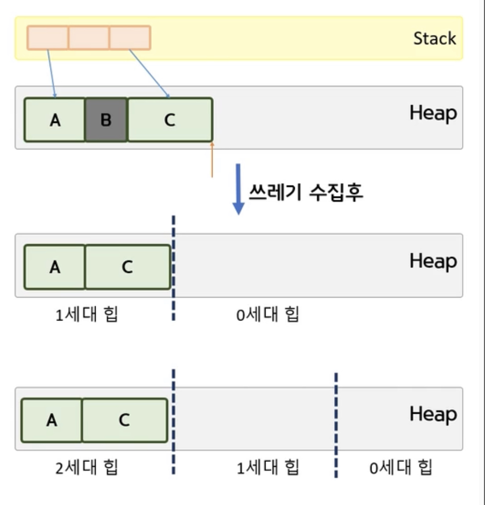

# 목차

---

# Dispose

C#은 메모리 관리를 해주기 때문에 new 를 한 뒤에는 자원을 해제하지 않아도 된다.

하지만 파일, 네트워크, DB는 메소드를 사용해서 명시적으로 자원을 해제애 줘야한다.

| 일반적 타입      | 파일, 네트워크, DB                         |
| ---------------- | ------------------------------------------ |
| GC에 의해 수거됨 | Dispose() 메서드를 사용해서 해지 해줘야함. |

왜 why?

- 참조 변수가 더 이상 참조를 하지 않아도 메모리는 즉시 수집되지 않는다.

  특정 조건(메모리 부족, 사용자가 강제로 돌리는등)을 만족할때 메모리 수집기가 동작.

  ```C#
  GC.Collect();   //GC강제 수집
  ```

  하지만 바로 수집(삭제)되지는 않는다.

  ```C#
  GC.WaitForPendingFinalizers();    //이 함수를 넣으면 GC가 수행될때 까지 대기.
  ```

# Dispose

File을 열고 닫을때는 Win32 API인 CreateFile() / CloseFile()을 사용한다.

- 이때 파일을 점유하고 있기 때문에 Colse를 하지 않을 경우 다른 사용자가 파일을 쓸 수 없다.

  소멸자에서 Close()의 문제점

  - GC로 인해 Close()가 되는 타이밍을 예상할 수 없다.

  - 위의 문제를 해결하기 위해서 DisPose()를 통해서 해제해준다.

<br>

예시

```C#
using System;
using System.IO;

class Program
{
    public static void Foo()
    {
        FileStream fs1 = new FileStream("a.txt", FileMode.OpenOrCreate, FileAccess.ReadWrite, FileShare.None);
    }
    static void Main()
    {
        Foo();

        Console.WriteLine("Main");

        FileStream fs2 = new FileStream("a.txt", FileMode.OpenOrCreate, FileAccess.ReadWrite, FileShare.None);

    }
}
```

이렇게 하면 해당 코드는 Foo()에서 자원을 점유하고 있기 때문에 에러가 난다.

해결법1)

GC를 강제 수행 한다.

```C#
GC.Collect();
GC.WaitForPendingFinalizers();
```

- 사용자가 직접 GC를 돌리는 경우 좋지 않다.

해결법2)

File이 필요 없는 시점에서 Dispose()를 호출한다.

```C#
public static void Foo()
{
    FileStream fs1 = new FileStream("a.txt", FileMode.OpenOrCreate, FileAccess.ReadWrite, FileShare.None);

    fs1.Dispose()
}
```

# GC (Garbage Collection)

? 변수는 생성된지 오랜 시간이 지난 변수가 더 오래 살아 남는다

- Main()과 같이 콜스택 위에 있는 함수에서 변수가 생성될 경우

- 전역 변수일 경우

GC는 위의 특징을 잘 활용하여 만들었다.

## 언어의 메모리 할당 차이

|                  | C/C++                                          | C#                 |
| ---------------- | ---------------------------------------------- | ------------------ |
| 메모리 할당 방식 | 메모리 블록을 나눠서 적합한 공간을 찾아서 할당 | 연속된 공간에 할당 |

C# 의 메모리 할당 장점

1. 속도가 빠름

2. GC대상을 알기 쉬움

   메모리의 처음부터 대상을 하나씩 조사한다.

C#에서는 메모리 블록을 나누지 않으나 CG에서 메모리 블록을 나눈다

1.  1번 GC가 된 이후 남은 객체들은 1세대 힙으로 승격 시킨다.
2.  이후 새롭게 만들어지는 객체들은 0세대 힙에 저장한다.
3.  0세대 힙이 가득 찰 경우 2번째 GC를 하고 0세대 힙만 확인한다.
4.  1세대를 2세대로, 0세대를 1세대로 승격 시킨다.
    -- 반복 --



단점

- 더이상 필요없는 객체도 높은 세대일 경우 하위 세대가 꽉 차지 않는 한 해제 되지 않는다.

  메모리 누수 있다.

  > ? 사용자가 GC를 돌릴 경우 세대 승격으로 인하여 회수가 자주 안되는 객체가 발생할 수 있다.

```C#
using System;

class A { }
class B { }
class C { }

class Program
{
    static void Main()
    {
        A a1 = new A();
        B b1 = new B();
        C c1 = new C();

        Console.WriteLine(GC.GetGeneration(a1));    // 0 (세대)
        GC.Collect(0);                              // 0 세대 GC
        b1 = null;

        Console.WriteLine(GC.GetGeneration(a1));    // 1 (세대)
        GC.Collect(0);                              // 0 세대 GC

        Console.WriteLine(GC.GetGeneration(a1));    // 1 세대
                                                    // why) 0 세대만 GC를 할 경우 1세대는 GC나 세대 승격이 되지 않는다.
        GC.Collect(1);

        Console.WriteLine(GC.GetGeneration(a1));    // 2 세대
        A a2 = new A1();
    }
}
```
