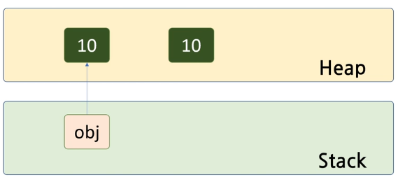

# 목차

<br>

---

# 패턴 매칭

임의의 개체가 특정 패턴(모양, 타입, 값)을 만족 하는지 조사 하는 것

1. type pattern matching (C# 초기부터 지원, 7.0에서 기능 추가)
2. var pattern matching (C# 7.0)
3. const pattern matching (C# 7.0)
4. switch expression (C# 8.0)

<br>

---

## type pattern matching

Base객체를 받아서 세부 구현 사항을 확인 할때 `is`를 통해서 가능하다.

`객체 is 타입`

```C#
    public static void Draw(Shape s)
    {
        if ( s is Circle )
        {
            Circle c1 = (Circle)s;      //Shape는 radius가 없기 때문에 캐스팅 필요.
            double d = c1.radius;
        }
    }
```

하지만 위와 같이 캐스팅까지 하는 경우가 매우 많아서 C#(7.0)에서는 이를 지원해 준다.

`객체 is type 변수`

객체를 변수로 캐스팅해서 제공까지 함.

```C#
if (s is Circle c1)
{
    double d = c1.radius;
}
```

var도 제공 한다.

```C#
// var pattern matching
if (s is var c2) // var c2 = s, 항상 참이 나오나 switch문에서 사용됨.
{

}
```

<br>

---

## const pattern matching

아래의 두 코드는 기능적으로 동일하다.

```C#
if ( n is 10 ) { }// const pattern matching
if ( n == 10 ) { }
```

하지만 해당 상황에서 달라질 경우가 있다.

```C#
if (obj == (object)10)              // ok
    Console.WriteLine("True");
else
    Console.WriteLine("False");     //해당 출력이 됨.
```

- why) false가 출력이 되는가?

  obj는 stack, 10은 heap에 올라가게 된다. 이떄 케스팅을 진행하게 되면 새로운 메모리에 10을 생성해서 obj가 가르키게 된다.

  그렇기 때문에 두 10은 주소값이 다르게 된다.

  즉 Boxing

    

true가 나오게 하려면 아래와 같이 작성해서 UnBoxing한다.ㅂ

```C#
if ((int)obj == 10)                 // ok
    Console.WriteLine("True");      //해당 출력이 됨.
else
    Console.WriteLine("False");
```

위는 상등 연산자를 사용하였으나 is를 쓰게 되면 캐스팅을 하지 않아도 된다.

> 아래와 위는 IL코드가 동일함.

```C#
if (obj is 10)
{
}
```

IF문 보다 Switch문을 사용할때 더 효과적이다.

<br>

---

### Switch문을 사용한 const pattern matching

| Type pattern matching | var pattern matching | const pattern matching |
| --------------------- | -------------------- | ---------------------- |
| `if( o is Circle c1)` | `if( o is var c1)`   | `if( o is 10)`         |

1.  const pattern matching

    ```C#
    // 값을 조사 한다.
    case null:
        break;
    ```

2.  type pattern matching

    해당 타입을 조사한다

    캐스팅 까지 수행

    ```C#
     // type pattern matching
     case Circle c:
         break;
    ```

    - when을 통해 조건을 추가 할 수 도 있다.

      ```C#
      //when을 통해 조건을 추가함.
      case Rectangle r when r.width == r.height:
          break;
      ```

    ❗ when과 스위치 문을 사용할때 주의점

    > 보편적인 특성을 아래에 둬야 한다.<br>
    > 그렇지 않을 경우 보편적인 특성에서 걸려서 아래의 조건이 실행되지 않음

```C#
switch (s)
{
    // const pattern matching
    case null:
        break;

    // type pattern matching
    case Circle c:
        break;

    //when을 통해 조건을 추가함.
    case Rectangle r when r.width == r.height:
        break;

    // 해당 라인이 위의 case위에 있을 경우 위의 case는 실행이 안됨
    case Rectangle r:
        break;

    default:
        break;
}
```

<br>

---

## var Pattern Matching

var을 통해여 해당 타입을 그대로 따라갈 수 있다.

아래와 같이 작성하면, r 은 s의 타입을 그대로 따라가며 할 수 있다.

```C#
public static void Draw(Shape s)
{
    switch (s)
    {
        // 여러 타입 예외 코드를 줄일 수 있음.
        case var r when (group.Contains(r)) :
            break;

        default: break;
    }
    }
```

<br>

---

# Switch Express

C# 8.0 에서 새로운 switch문법을 추가 시켰다.

```C#
int s = n switch { 10 => 11, 20 => 22, 30 => 33, _ => 100 };
```

이를 Switch Express라고 한다.

💡 `_`은 default이다.

💡 보통 분기마다 개행해서 표현한다.

<br>

Statment (문, 문장)

- 프로그램을 구성하는 기본 요소

- C#에서 하나의 문장은 ;로 종료된다.

- 언어에 따라 정의가 약간씩 다르다.

Expression (표현식)

- 대부분언어가 유사한 정의를 사용

- 하나의 값으로 계산되는 식

  ex) `int n = 2 * 3 + 4 - n; `

- 연산자와 피연산자로 구성

- return으로 표기하지 않아도 하나의 값으로 반환된다.

- C#에서는 람다 처럼 `=>`를 이용해서 가능하다.

```C#
public int square(int n)
{
    return n * n;
}

public int square2(int n) => n * n; //expressiong
```

## 다양한 Switch Express

1. Type pattern matching
   - 필요 없는 변수는 \_로 표기하면 생성 안함.
   ```C#
   double area = s switch
   {
       null => 0,                                  // const pattern matching
       Point _ => 0,
       Circle c => Math.PI * c.Radius * c.Radius,
       Rectangle r => r.Width * r.Height,
       _ => 0
   };
   ```
2. tuple pattarn

   두가지 인자를 받아서 Switch사용 가능.

   ```C#
    int value1 = 0;
    int value2 = 0;

   var ret1 = (value1, value2) switch
   {
       (0, 0) => 0,
       var (a, b) when a > 100 => 100,
       var (a, b) when a <= 100 && b > 100 => 200,
       _ => 300
   };
   ```

3. positional pattern : Deconstructor 가 있는 타입

   - Deconstructor 로 인해튜플로 받을 수 있기 때문에 tuple pattarn가능

   ```C#
   Point pt = new Point();

   var ret2 = pt switch
   {
       (0, 0) => 0,
       var (a, b) when a > 100 => 100,
       var (a, b) when a <= 100 && b > 100 => 200,
       _ => 300
   };
   ```
