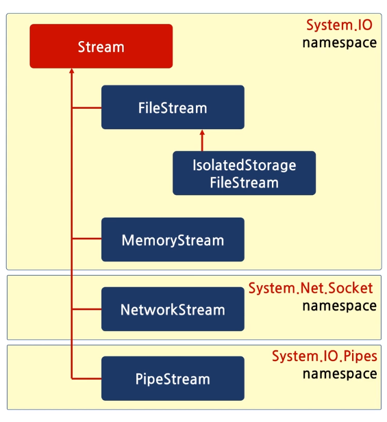
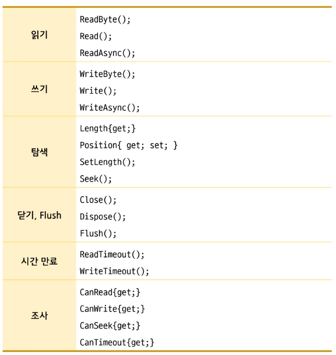
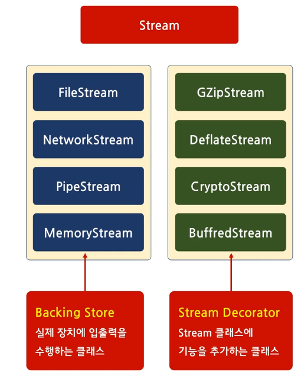
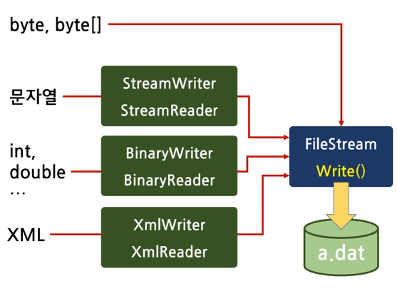
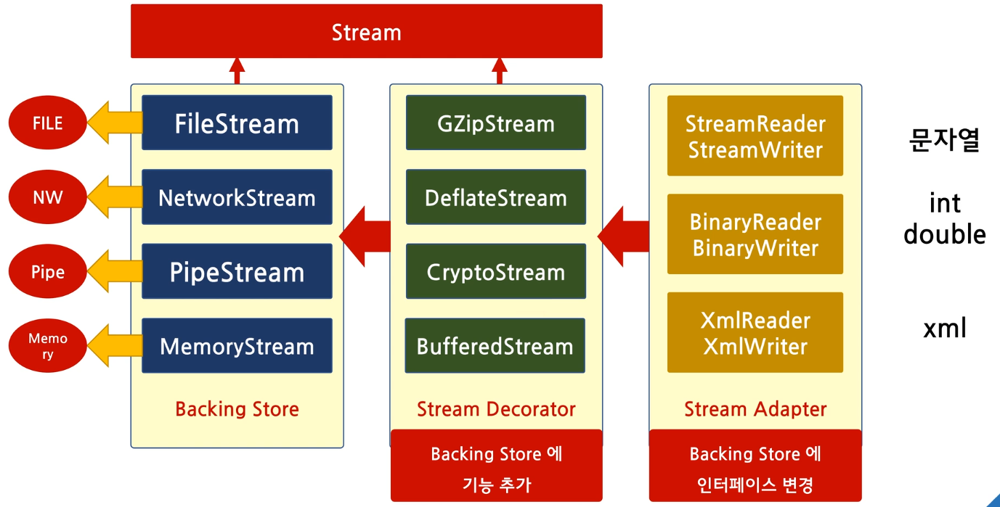

# 목차

<br>

---

# File & Stream

- 파일에 읽고 쓰는 작업

  FileStream 과 Stream Class를 사용

- 복사, 이동, 삭제, 정보 조사등

  File, FileInfo, Directory, DirectoryInfo를 사용

일반적 파일 함수들

```C#
bool b1 = File.Exists("c:\\windows\\System32\\calc.exe");

DateTime tm = File.GetCreationTime("c:\\windows\\System32\\calc.exe");

File.Copy("c:\\windows\\System32\\calc.exe", "d:\\a.exe");
```

FileInfo (파일 정보 확인시 사용하는 클래스)

```C#
FileInfo fi = new FileInfo("c:\\windows\\System32\\calc.exe");

bool b2 = fi.Exists;
DateTime tm2 = fi.CreationTime;

fi.CopyTo("d:\\a.exe");
```

- 단 FileInfo는 Instance이다.

<br>

| File 클래스                                         | File Info                                         |
| --------------------------------------------------- | ------------------------------------------------- |
| 파일에 대한 정보, 복사, 이동, 삭제 등을 하는 클래스 | File클래스와 동일한 기능을 수행                   |
| 대부분의 메서드가 `정적 메서드`로 되어있다.         | 대부분의 멤버가 `인스턴스 멤버`로 되어 있다.      |
|                                                     | 메서드보다는 `속성(Property)`으로 표기 되어 있다. |

<br>

# Directory

일반 메서드

```C#
Directory.CreateDirectory("D:\\AAA");
Directory.Delete("D:\\AAA");

string[] drives = Directory.GetLogicalDrives();
foreach (var s in drives) Console.WriteLine(s);
string[] files = Directory.GetFiles("C:\\windows");
foreach (var s in files) Console.WriteLine(s);
```

DirectoryInfo사용

```C#
DirectoryInfo di = new DirectoryInfo("C:\\windows");

FileInfo[] files2 = di.GetFiles();

foreach (var a in files2)
{
    Console.WriteLine(a);
    Console.WriteLine(a.Name);
}
```

## Directory, File응용

File Stream을 사용하면 win API를 사용하는 것 보다 더 쉽게 얻을 수 있다.

```C#
using System;
using System.IO;

class Program
{

    public static void PrintExeName(string path)
    {
        string[] names = Directory.GetFiles(path, "*.exe"); //path의 모든 exe파일을 얻는다.
        foreach (var name in names)
        {
            //File.Delete(name);
            // Console.WriteLine(name);
            Path.GetFileName(name);     //전체 경로에서 실행 파일 이름과 확장명 얻는다.
        }
        string[] dirs = Directory.GetDirectories(path);

        foreach (var dir in dirs)
            PrintExeName(dir);
    }
    public static void Main()
    {
        PrintExeName("B:\\CSHARP");
    }
}
```

# File Stream

파일스트림을 만들 경우 경로, 파일 생성 | 파일 오픈, 파일 접근 권한을 주면 된다.

```C#
FileStream fs1 = new FileStream("d:\\a.txt", FileMode.Create, FileAccess.ReadWrite);
// using FileStream fs1 = new FileStream("d:\\a.txt", FileMode.Create, FileAccess.ReadWrite);
```

파일을 새엇ㅇ하거나 열 경우 닫아줘야 한다(Close)

- using을 이용해서 자동으로 Close를 지원한다.

파일을 쓸 경우 Byte로 넣어야 한다.

```C#
 byte b1 = 10;
 //+ 1. 파일에 한 바이트 쓰기
 fs1.WriteByte(b1);                  // 10

 byte[] buff = { 1, 2, 3, 4, 5, 6, 7, 8, 9, 10 };
 //+ 2. byte 배열 쓰기
 fs1.Write(buff, 0, buff.Length);    // 10, 1,2,3,4,5,6,
```

- 배열 혹은 1바이트만 넣을 수 있다.

읽을 경우 ReadByte로 알 수 있다.

```c#
//+ 4. 한 바이트 읽기
int n = fs1.ReadByte();
Console.WriteLine(n);               // 3 {10 : 0 , 1 : 1, 2: 2, 3: 3}
```

- 파일을 쓰게 될 경우 파일 포인터는 마지막 작성한 곳 끝으로 이동한다.

파일 포인터를 움직일 경우 아래와 같이 움직인다.

```C#
//+ 3. 파일 포인터 이동
fs1.Seek(3, SeekOrigin.Begin);      //3byte이동
```

- Option을 통해서 조절 할 수 도 있다.

문자열 또한 쓰거나 출력 할 수 있다.

```C#
//+ 5. 문자열 출력
string s = "Hello";
// 문자열 => byte[] 로 변경.
// 인코딩을 명시적으로 하여 전달해 줘야함.
byte[] buff2 = Encoding.ASCII.GetBytes(s);
fs1.Write(buff2, 0, buff2.Length);
```

# C# Stream

C# 에서 Stream은 여러가지가 있다 (ex) File, Memory, Network, 등등) 이러한 클래스에서 공통으로 제공하는 함수가 있기 때문에 추상 클래스 (`Interface`)를 만들어서 제공한다.

<br>



<br>

Stream Interface Member



<br>

하지만 네트워크와 같은 경우는 Seek를 통해 처음으로 가게 되면 지원하지 않는다는 오류 메시지가 뜬다.

- Interface를 통해 동일한 함수를 제공받으나 지원되지 않는 코드가 몇개 있다. (컴파일에 감지 불가)

  그렇기 때문에 제일 아래 조사 기능을 추가했다.

```C#
ns.Write(buff, 0, buff.Length);
Console.WriteLine(ns.CanSeek); // false
//ns.Seek(0, SeekOrigin.Begin); //Runtime Exception
```

# Stream 구조

- Stream Class

- Stream Decorator

  "Decorator" 디자인 패턴

- Stream Adapter

  "Adapter" 디자인 패턴

Stream Class에 Hello를 전달하면 Stream Adapter -> Stream Decorator -> Stream Class 로 전달이 된다.

# Decorator 패턴

원래의 기능에 새로운 기능을 추가 하고 싶을 경우 사용하는 패턴.

---

## 상속 사용

객체 지향에서 기능을 추가 하고 싶을 경우 상속을 이용해서 추가한다.

```C#
class Fighter
{
    public virtual void Fire()
    {
        Console.WriteLine("Fire Missile");
    }
}
// 상속을 사용한 기능 추가
class RightMissileFighter : Fighter
{
    public override void Fire()
    {
        base.Fire(); // 기존 기능 사용
        Console.WriteLine("Fire Right Missile"); // 추가 기능
    }
}

class Program
{
    public static void Main()
    {
        Fighter fg = new Fighter();
        fg.Fire();

        // 아이템 획득
        Fighter fg2 = new RightMissileFighter();
        fg2.Fire();
    }
}
```

하지만 위와 같이 작성하게 되면 기존 객체에 기능이 추가 되는 것이 아닌 새로운 기능을 가진 객체가 생성된다.

상속 사용시

- 객체가 아닌 클래스에 기능이 추가됨.

- 동적인 실행 시간에 기능이 추가된 것이 아닌 코드 작성시 정적인 기능의 추가

---

## 포함 사용.

클래스가 상속이 아닌 기존 객체를 포함할 경우

- 기존 객체는 유지가 된다.

```C#
using System;

class Fighter
{
    public virtual void Fire()
    {
        Console.WriteLine("Fire Missile");
    }
}

class RightMissile
{
    private Fighter fighter = null;

    public RightMissile(Fighter fg) { fighter = fg; }

    public void Fire()
    {
        fighter.Fire(); // 기존 객체의 기능 사용
        Console.WriteLine("Fire Right Missile");
    }
}

class Program
{
    public static void Main()
    {
        Fighter fg = new Fighter();
        fg.Fire();

        // 아이템 획득
        RightMissile fg2 = new RightMissile(fg);
        fg2.Fire();
    }
}
```

| --             | 상속           | 포함           |
| -------------- | -------------- | -------------- |
| 기능 추가 대상 | 클래스         | 객체           |
| 비고           | 정적 기능 추가 | 동적 기능 추가 |

<br>

---

추가적으로 기능을 연속 추가 하고 싶을 경우

이전 클래스와 동일하게 확장 할 경우 원본 타입인 Fighter만 넣을 수 있다.

- 인터페이스를 사용한다.

```C#
using System;

interface Item
{
    void Fire();
}

class Fighter : Item
{
    public virtual void Fire()
    {
        Console.WriteLine("Fire Missile");
    }
}

class RightMissile : Item
{
    private Item fighter = null;

    public RightMissile(Item fg) { fighter = fg; }

    public void Fire()
    {
        fighter.Fire(); // 기존 객체의 기능 사용
        Console.WriteLine("Fire Right Missile");
    }
}

class LeftMissile : Item
{
    private Item fighter = null;

    public LeftMissile(Item fg) { fighter = fg; }

    public void Fire()
    {
        fighter.Fire();
        Console.WriteLine("Fire Left Missile");
    }
}

class Program
{
    public static void Main()
    {
        Fighter fg = new Fighter();
        fg.Fire();

        // 아이템 획득
        RightMissile fg2 = new RightMissile(fg);
        fg2.Fire();

        LeftMissile fg3 = new LeftMissile(fg2);
        fg3.Fire();
    }
}
```

여기서 RightMissile, LeftMissile은 기능을 추가하는 기능 추가 객체(Decorator)이라고 한다.

- Decorator은 동일한 기반 클래스(인터페이스 또는 추상 클래스)가 있어야 한다.

---

## 정리

기본 객체(여기서 Fighter)와 기능을 추가하는 객체 즉 Decorator(여기서 RightMissile, LeftMissile)을 분리해서 설계 한다.

포장지는 객체 뿐 아니라 객체를 포장한 객체도 다시 포장 할 수 있다.

- Decorator로 객체를 꾸민 객체를 다시 Decorator으로 꾸밀 수 있다.

- 객체와 기능 추가 객체는 공통의 기반 클래스를 사용해야 한다.

---

## Stream Decorator

해당 코드는 파일을 불러와서 쓰는 코드이다.

```C#
using System;
using System.IO;
using System.IO.Compression;
using System.Net;

class Program
{
    public static void Main()
    {
        byte[] buff = new byte[1024 * 1024]; // 1M

        FileStream fs = new FileStream("d:\\a.dat", FileMode.Create);
        fs.Write(buff, 0, buff.Length);

        fs.Close();
    }
}
```

만약 위의 코드에 압축을 추가한다고 생각해 본다.

1. FileStream에 새로운 메서드 추가

- Write() 뿐만 아닌, ZipWrite()를 추가해 준다.

  이는 FileStream 뿐 아니라 모든 Stream을 상속받은 클래스에 메서드가 추가되어야 한다는 단점이 있다.

2. 기반 클래스에 메서드 추가

- Stream(`Interface`)에 Class를 추가 한다.

  이는 새로운 요구사항이 생길 때 마다 Stream을 수정해야 한다.

  - 개발 폐쇠 위배 (OCP)

3. Decorator 패턴 사용

   실제 장치에 입출력은 수행하는 클래스는 그대로 두고 기능을 추가하는 객체(Decorator)을 만들어서 제공한다.

```C#
using System;
using System.IO;
using System.IO.Compression;
using System.Net;

class Program
{
    public static void Main()
    {
        byte[] buff = new byte[1024 * 1024]; // 1M

        FileStream fs = new FileStream("d:\\a.dat", FileMode.Create);

        //Decorator
        GZipStream gs = new GZipStream(fs, CompressionLevel.Fastest);

        //Decorator
        BufferedStream bs = new BufferedStream(gs);


        //fs.Write(buff, 0, buff.Length);
        bs.Write(buff, 0, buff.Length);
        bs.Close();
        gs.Close();
        fs.Close();
    }
}
```

# Stream Decorator

C# 에는 실제로 장치에 입출력을 수행하는 클래스를 Backing Store라고 부른다

- FileStream, NetworkStream, PipeStream, MemoryStream

압축이나, 암호화등 여러 기능을 추가 하고 싶을 경우 Decorator을 지원한다.

- GZipStream, DeflateStream, CryptoStream, BuffredStream

둘 다 Stream에서 파생하기 때문에 중첩이 가능하다.



<br>

---

# Adapter

Adapter 디자인 패턴

- 기존 클래스(객체)의 인터페이스를 변경해서 클라이언트의 요구사항을 만족하게 하는것.

ex1)

String을 입력 하는 FileStream을 만들고 싶다고 가정한다.

- FileStream은 Byte만 넣을 수 있기 떄문에 string을 byte로 변환한다.

```C#
using System;
using System.IO;
using System.IO.Compression;
using System.Text;

class Program
{
    public static void Main()
    {
        Console.WriteLine("Hello");

        FileStream fs = new FileStream("D:\\a.txt", FileMode.Create);

        // "Hello" 를 파일에 쓰고 싶다.
        string s = "hello";
        byte[] buff = Encoding.ASCII.GetBytes(s);

        fs.Write(buff, 0, buff.Length);

        fs.Close();
    }
}
```

이때 변환과 write를 한번에 해주는 Adapter을 찾는다. (StreamWriter)

```C#
using System;
using System.IO;
using System.IO.Compression;
using System.Text;

class Program
{
    public static void Main()
    {
        Console.WriteLine("Hello");

        FileStream fs = new FileStream("D:\\a.txt", FileMode.Create);

        StreamWriter sw = new StreamWriter(fs, Encoding.ASCII);
        sw.WriteLine("Hello");

        sw.Close();
        fs.Close();
    }
}
```

| --          | Decorator   | Adapter           |
| ----------- | ----------- | ----------------- |
| 의도        | 기능의 추가 | 인터페이스의 변경 |
| 메서드 이름 | 동일        | 변경              |
| 중첩 여부   | 가능        | 불가              |

- Decorator

  ```C#
  GZipStream gz = new GZipStream(fs);
  gz.Write();               //메서드 이름 그대로
  ```

- Adapter

  ```C#
  StreamWriter sw = new StreamWriter(fs, Encoding.ASCII);
  sw.WriteLine("Hello");    //메서드 이름이 바뀜
  ```

<br>

원래는 각각의 데이터를 byte로 변환 한 다음에 File에 작성해야 하지만

아래와 같이 해당하는 Adapter을 통해 FileStream에 접근하여 할 수 있다.



# 정리

이전에 Adapter -> Decorator -> Backing Store(직접 입출력)을 한다고 하였다.

만약 내가 어떠한 객체를 압축을 한다면 해당 Backing Store을 GZipStream으로 감싼뒤에 Stream Adapter로 호출하면 된다.

- Backing Store, Stream Decorator은 Stream을 기반 클래스로 가지고 있기 떄문에 중첩이 가능.

- Stream Decorator은 Backing Store에 기능을 추가하는 역활

- Stream Adapter은 Backing Store에 인터페이스를 변경하는 역활을 한다.

<br>



<br>

---

# Pipe Stream

Sever과 Client가 통신을 할 떄 Pipe를 사용하여 통신 할 수 있다.

이때 파이프는 2가지로 나뉜다.

1. Named Pipe

   이름이 있는 파이프

   클라이언트는 파이프 이름을 사용해서 접속 할 수 있다.

2. Anonymous Pipe

   이름이 없는 파이프

   이름이 없으므로 파이프 핸들(참조)를 클라이언트에게 전달해 줘야 한다.

Echo Sever

```C#
using System;
using System.IO;
using System.IO.Pipes;
using System.Text;

class Program
{
    public static void RunServer()
    {
        NamedPipeServerStream ps = new NamedPipeServerStream("MyPipe",              // 이름.
                                                   PipeDirection.InOut,             // 양방향
                                                   1,                               // 동일 이름의 파이프의 갯수
                                                   PipeTransmissionMode.Message);   // 데이터 주고 받을 경우 방식 TCP : Stream, UDP :Message
        while (true)
        {
            Console.WriteLine("Wait Client...");
            ps.WaitForConnection();     // Client 접속 대기
            Console.WriteLine("Client Connected...");

            // 문자열 주고 받을 경우 어답터를 통하여 사용하면 편리하다.
            // Stream Adapter
            var sr = new StreamReader(ps);
            var sw = new StreamWriter(ps);

            //자동 flush
            sw.AutoFlush = true;

            //ECHO Sever
            string data = sr.ReadLine();

            Console.WriteLine($"SERVER RECEIVED : {data}");

            sw.WriteLine(data);
            // 버퍼에 있는 데이터를 모두 처리하는 함수
            //sw.Flush();

            ps.Disconnect();
        }
    }

    public static void Main()
    {
        RunServer();
        Console.WriteLine("Main");
        Console.ReadLine();
    }
}
```

이와 같은 Pipe를 만들 경우 Clinet에서 이름을 맞춰 주어야 한다.

```C#
using System;
using System.IO;
using System.IO.Pipes;

class Program
{
    public static void RunClient()
    {
        NamedPipeClientStream ps = new NamedPipeClientStream("MyPipe");

        ps.Connect();

        var sr = new StreamReader(ps);
        var sw = new StreamWriter(ps);
        sw.AutoFlush = true;

        sw.WriteLine("Hello");

        string s = sr.ReadLine();
        Console.WriteLine($"RECEIVED DATA: {s}");

        ps.Close();
    }

    public static void Main()
    {
        RunClient();
    }
}
```
