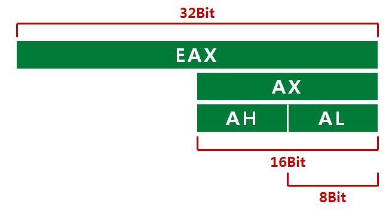
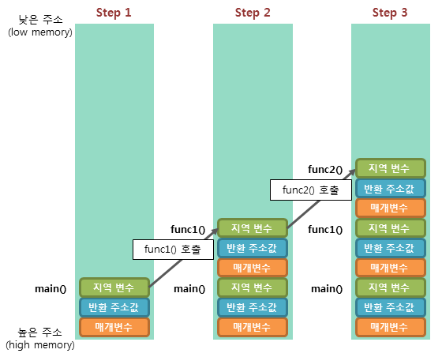

# 목차

1.  [📌 어셈블러](#-어셈블러)
2.  [📌 컴퓨터 구조](#-컴퓨터-구조)
3.  [📌 프로세스 메모리 구조](#-프로세스-메모리-구조)
4.  [📌 데이터 기초](#-데이터-기초)
5.  [📌 레지스터](#-레지스터)
6.  [📌 변수의 선언 및 사용](#-변수의-선언-및-사용)
7.  [📌 문자와 엔디안](#-문자와-엔디안)
8.  [📌 사칙연산](#-사칙연산)
9.  [📌 시프트 연산과 논리 연산](#-시프트-연산과-논리-연산)
10. [📌 분기문](#-분기문)
11. [📌 반복문](#-반복문)
12. [📌 배열과 주소](#-배열과-주소)
13. [📌 함수 기초](#-함수-기초)
14. [📌 스텍 메모리](#-스텍-메모리)

<br>

---

# 📌 어셈블러

프로그래밍 언어는 고급 언어에서 기계어로 변환하는 과정이 필요하다.

이 과정에서 어셈블리 언어가 필요한데 이 과정을 해주는 것이 컴파일러, 어셈블러 이다.

[

](http://www.kwangsiklee.com/2018/06/%EC%BB%B4%ED%8C%8C%EC%9D%BC%EB%9F%AC-%EA%B0%95%EC%9D%98-1-%EA%B0%9C%EC%9A%94/)

실행되는 코드이외에도 데이터나 여러 정보들이 있을 수 있는데, 작성한 SASM을 보면 그림과 같이 섹션이 나누어 진 것이 보인다.

```avrasm
%include "io64.inc"

section .text
global CMAIN
CMAIN:
  PRINT_STRING m

  xor rax, rax
  ret

section .data
   msg db "Hello World", 0x00
```

[

](https://furysecurity.tistory.com/28)

> 작성한 코드에서는 Section(".text")에 코드가 들어가고 Data즉 HelloWorld는 Section(".data")에 들어가게 된다.

[코드](Code\Intro\HelloWorld.asm)

<br>

# 📌 컴퓨터 구조

[

](https://m.blog.naver.com/kjyong86/140161466414)

컴퓨터 구조의 핵심은 CPU, Main Memory(RAM), Hard Disk가 있는데, Ram은 휘발성, Disk는 비 휘발성인 특징이 있고, 속도는 Ram이 하드 디스크 보다 빠르다.

일반적으로 데이터를 Disk -> Ram -> CPU로 올리기 떄문에 속도는 CPU에 가까울수록 빠르다.

CPU에서는 연산(실행)이 이루어 진다

> RAM에 올라간 프로그램은 작업 관리자 창에서 볼 수 있음.

<br>

# 📌 프로세스 메모리 구조

[

](https://velog.io/@yeahg_dev/TIL11.-C-%EB%A9%94%EB%AA%A8%EB%A6%AC-%ED%95%A0%EB%8B%B9-%EB%A9%94%EB%AA%A8%EB%A6%AC-%EA%B5%AC%EC%A1%B0)

위와 같이 코드, 데이터, 힙, 스택으로 구분되어 있으며 힙은 아래로 스택은 위로 확장하는 구조를 가진다.

> 힙이나 스택이 가득차서 다른 영역을 침범하는 경우 큰 손실을 일의킬 수 있음.

<br>

# 📌 데이터 기초

Q) 데이터 저장은 어떻게 하나?

A) 비트와 바이트를 통해 구현한다.

    비트는 기초적인 데이터 단위를 의미하고
    8개의 비트로 이루어진 데이터의 양을 바이트라고 한다.

데이터의 표현

1.  데이터가 표현할 수 있는 크기를 선택

2.  해당 데이터의 비트값을 키고 끄는것으로 표현한다.

    - 데이터의 음수 양수 표현을 알아야 한다.

            양수의 표현 우리가 알던 2^자리수 로 표기함
            음의 수는 보수를 취해주어 계산한다.
            일반적으로 데이터 표현시 첫번째 비트는 부호비트이다.
            EX) 1000 0000 => -128
                0100 0000 => 64

    - 2진(바이너리 : BIN) 데이터는 일반적으로 0b를 앞에 붙여 표현한다.

      EX) 0b1(1), 0b11(3)

    - 16진(핵사 : HEX) 데이터는 일반적으로 0x를 앞에 붙여 표현한다.

      EX) 0x1(1), 0x11(19)

진법 표현은 계산기 앱으로도 쉽게 구할 수 있음


<br>

# 📌 레지스터

어셈블리 프로그래밍에서는 CPU, 레지스터, 메모리가 핵심 역활을 하게 되는데, 메모리에서 레지스터로 올라가는 과정을 살펴본다.

    2^6(64) bit = 2^3(8) byte = 2^2 (4) word = 2 dword(Double-Word) = 1 qword(quad-word)

Q) 레지스터를 사용하는 이유

A) CPU가 연산을 한 내용을 임시적으로 저장하기 위한 용도.

    메인 메모리는 접근하기에 시간이 많이 걸리므로 레지스터를 CPU안에 넣어서 계산값을 저장함.

레지스터는 여러 종류가 있다.
각각의 크기에 맞게 사용하게 되는데

1. rax 64 bit(전체)를 사용
2. eax 32 bit(절반)를 사용
3. ax 16 bit(1/4)를 사용
4. ah,al 8 bit (15/16)를 사용

> 범용 레지스터는 rax ~ rdx까지 있다 [참조](https://peemangit.tistory.com/37)<br>
> 그림에서는 나오지 않았으나 64 bit 운영체제일 경우 rax 까지 확장됨



```avrasm
mov {reg1}, {value}
```

- 특정 값을 레지스터 안에 넣는 명령어

```avrasm
mov {reg1}. {reg2}
```

- reg2값을 reg1으로 복사

EX)


> 💡 cl은 최하위 8bit를 사용하는데 너무 큰 값이 들어가서 에러가 뜸

디버깅을 사용하면 해당 레지스터를 변경하는 것을 쉽게 볼 수 있음

    레지스터 값은 SASM기준으로 디버그에서 Show Register을 키면 볼 수 있다


12번째 라인에서 eax(4바이트)에 들어있는 0x1234에 al(2바이트)인 00을 넣어 al을 0으로 만든 것을 볼 수 있다.

- 0x1234 (4byte) 에서 0x00이 아닌 0x1200으로 변함을 볼 수 있다.

[코드](Code\Intro\Register.asm)

<br>

# 📌 변수의 선언 및 사용

초기화 된 데이터를 사용할 경우 data 영역에 들어감

변수 = 메모리

    {변수이름} {크기} {초기값}
    크기 명령어(byte) => db(1) dw(2) dd(4) dq(8)
    즉 4바이트 받고싶으면 dd
    ex) Data dw 0x00 = Data라는 변수에 2바이트, 00으로 초기화

초기화 되지 않은 데이터를 사용할 경우 bss영역에 들어감

    {변수이름} {크기} {개수}
    크기 명령어(byte) => resb(1) resw(2) resd(4) resq(8)
    ex) Data resb 10 = Data라는 4바이트 변수를 10개 생성

<br>

> Q) 두가지 영역을 나눈 이유 <br>
> A) 초기화 되지 않은 데이터들은 기본 값으로 세팅이 되므로, 크기만 알 고 있으면 파일의 크기를 줄일 수 있음.

<br>


<br>

```avrasm
section .data
    a db 0x11   ; [0x11]
    b dw 0x2222
    c dd 0x33333333
    d dq 0x4444444444444444

section .bss
    e resb 10
```

<br>

해당 코드의 데이터 출력시 a~d까지 연속된 데이터를 할당함을 볼 수 있다.

Why) 데이터 영역에 연속된 공간에 할당했기 때문

<br>

> Q) e는 왜 연속된 공간이 아니냐<br>
> A) e는 해당 공간이 아닌 bss에 선언했기 떄문.

<br>


<br>

```avrasm
section .text
global CMAIN
CMAIN:

  ; 변수를 레지스터에 할당
  mov rax, a
  ; 이때 주소값으로 전달해준다. 즉 콜바이 벨류가 아닌 레퍼
  ret
```

<br>

위 코드를 실행 시킬 경우 rax 는 a의 값인 0x11이 아닌 0x403010을 저장함을 볼 수 있다.

이는 값인 0x11이 아닌 a메모리 주소인 0x403010임을 알 수 있다.

또한 a메모리 주소에 1바이트를 더한 0x403011은 b의 주소를 볼 수 있다. 이는 메모리가 연속적으로 할당 되었다는 사실을 알 수 있다.

<br>


> Q) 왜 벨류가 아닌 레퍼를 주소로 주나 <br>
> A) 변수는 "바뀔 수 있는 수" 이기 떄문에 벨류가 아닌 레퍼를 주어서 바뀌는지 알 수 있어야 한다.<br>
> 💡 벨류를 참고하고 싶으면 []로 감싸야 한다.

<br>

```avrasm
%include "io64.inc"

section .text
global CMAIN
CMAIN:
    mov rbp, rsp; for correct debugging
    mov rax, 0x12345678

    ; 변수를 메모리에 할당
    ;mov rax, a
    ; 이때 주소값으로 전달해준다. 즉 콜바이 벨류가 아닌 레퍼
    ; mov rax, [a]
    ; []를 넣어주면 해당 데이터의 벨류를 가지고 온다.
    ; 하지만 크기를 지정하지 않았으므로 rax의 크기 만큼 꺼내옴

    mov al, [a]
    ; al (1 Byte)만 꺼내온다. 이렇게 하면 위에서 12345678으로 되어있는 값에서 12345611로 변함을 볼 수 있다.
     ret

    ; ex) Data dw 0x00

section .data
    a db 0x11   ; [0x11]
    b dw 0x2222
    c dd 0x33333333
    d dq 0x4444444444444444

section .bss
    e resb 10
```


반대로 값을 메모리에 넣을 수 있다.

```avrasm
%include "io64.inc"

section .text
global CMAIN
CMAIN:
    mov rbp, rsp; for correct debugging
    ...
    mov [a], cl         ; 레지스터 값을 데이터에 할당
    mov [a], byte 0x99  ; 상수를 데이터에 할당

    ret
```

> 💡 상수를 메모리에 넣을때, 크기를 지정해주는 것이 필수


<br>

> Q) a의 크기(1byte) 보다 큰 word(2byte)를 할당하면 어떻게 될까<br>
> A) 해당 값을 넘어서 다른 데이터의 메모리도 바꾼다. (Overr Flow)


[코드](Code\Intro\Variable.asm)

<br>

# 📌 문자와 엔디안

데이터는 항상 2비트 진수로 표현된다.

16진수의 0x11(17)은 비트로 10001(0001 0001)로 표기된다.

즉 모든 수는 2비트로 변환되어 표기됨

변수의 값에 데이터를 여러개 넣을 수 있다.

```avrasm
msg db 'hello World', 0x00
a db 0x11, 0x11, 0x11, 0x11
; {변수이름} {크기} {초기값}
```

위와 같이 넣을 경우 a가 가르키는 주소값을 넘어서 데이터가 들어가게 된다.

> 크기에 해당하는 여러 초기값을 연속적 공간에 할당한다. <br>
> hello World또한 디버그를 보면 byte단위로 아스키 코드로 char이 기록되어 있다. <br>
> 💡 데이터의 끝에 끝을 나타내는 0x00을 붙여준다.


데이터를 저장할때, dd 4byte로 저장할 경우 아래와 같이 데이터가 12,34,56,78이 아닌 78,56,34,12로 뒤집혀서 저장됨을 볼 수 있다.

메모리에 저장이 될 때 2가지 방법이 있다. (엔디안)

1. 정순으로 저장 (Big Endian)
2. 역순으로 저장 (Little Endian)

> 💡 서버와 클라간의 엔디안 동기화 떄문에 문제가 생길 수 도 있으니 데이터 순서에 따라 다른 정보가 될 수 도 있음.

[

](https://genesis8.tistory.com/37)

> Q) 왜 이렇게 둘로 나눠 놨을까? <br>
> A) 각각의 포멧의 장단점이 있음

1.  리틀 엔디안
    캐스팅에 유리함

         빅 엔디안과 다르게 캐스팅(바이트를 줄이거나 늘리는 행위)를 할 경우 앞에서부터 데이터를 자를 수 있음

2.  빅 엔디안
    숫자 비교에 유리함

        큰 자리 부터 비교하면 되므로 큰 자릿수의 숫자부터 비교하기 편하다.

|      | 리틀 엔디안     | 빅 엔디안        |
| ---- | --------------- | ---------------- |
| 장점 | 캐스팅에 유리함 | 대소 비교에 유리 |

[코드](Code\Intro\CharEndian.asm)

<br>

# 📌 사칙연산

## 데이터 입력, 출력

```avrasm
GET_DEC {byte} {데이터}
```

- 인풋창에서 특정 데이터(공간)에 십진수 데이터를 받는 방법

```avrasm
PRINT_DEC {byte}, {데이터}
```

- 특정 공간의 데이터를 10진수로 출력

> 💡 참고로 스트링은 `PRINT_STRING {데이터}`

<br>

```avrasm
%include "io64.inc"

section .text
global CMAIN
CMAIN:
    mov rbp, rsp; for correct debugging

    GET_DEC 1 , al      ;al을 1바이트 10진수를 받음
    GET_DEC 1 , num

    PRINT_DEC 1, al     ;al의 1바이트를 10진수로 출력
    NEWLINE             ;개행
    PRINT_DEC 1, num

    ret

section .bss
num resb 1 ;인풋으로 받으므로 초기화 할 필요 없음.

```

## 덧셈 사칙 연산

```avrasm
ADD a, b
```

- a의 공간에 b를 더한 값을 넣는다.

> 💡 단 a는 레지서터 혹은 메모리여야 하지만, b는 상수까지 가능하다. (a는 상수 X)
> a, b모두 메모리는 안된다.

<br>

Register + Variable (레지스터 + 변수)

```avrasm
GET_DEC 1 , num     ; 상수 입력
add al, num         ; 레지스터에 상수 더해줌
PRINT_DEC 1, al     ; 레지스터 출력 (Crash)
NEWLINE
```

<span style="color:red">Crash!!</span>

Why) 디버깅을 해볼 경우 num에는 1이 아닌 num의 주소값이 들어가 있음. <br>

> al은 1byte인데 num의 주소값을 더해 오버플로우 발생! <br>

Solve) num을 ref값이 아닌 value값으로 변경 즉 num -> [num]

<br>

```avrasm
GET_DEC 1 , al      ;al에 인풋을 받음
GET_DEC 1 , num     ; num을 받음
add al, [num]       ;al += num
PRINT_DEC 1, al     ;out put 33
NEWLINE
```

<br>

| 특이점   | 레지스터 | 변수                                    | 상수                       |
| -------- | -------- | --------------------------------------- | -------------------------- |
| 레지스터 | 평범     | 평범                                    | 일반 10진수 대입           |
| 변수     | 평범     | <span style="color:red">!!안됨!!</span> | 크기를 지정해 줘야 가능함. |

> 💡 변수는 []로 감싸지 않으면 ref값이 들어가게 된다.

[코드](Code\Intro\AddCalculator.asm)

<br>

## 곱하기 연산

곱연산은 더하기 연산과 다르게 까다롭다.

```avrasm
mul {reg}
```

- 레지스터가 1개 인데 특정 계산 값을 저장하는 곳이 따로 있다.

  - mul bl => al \* bl 연산을 해서 결과를 ax에 저장. (1byte)
  - mul bx => ax \* bx 연산 결과는 dx(상위 16비트) ax (하위 16비트) 에 저장 (2byte)

    위와 같이 계산 결과가 각각 저장된다.

```avrasm
%include "io64.inc"

section .text
global CMAIN
CMAIN:
    mov rbp, rsp    ;for correct debugging

    mov ax, 0
    mov al, 5
    mov bl, 8
    mul bl
    PRINT_DEC 2, ax ; output 40 (5*8)


    ret
```

## 나누기 연산

```avrasm
div {reg}
```

- 이또한 곱하기와 동일하게 1개 레지스터를 받고 계산 값을 저장하는 곳이 따로 있다.

  - div bl => ax / bl 연산을 해서al에 몫, ah에 나머지 저장. (1byte)

    위와 같이 계산 결과가 각각 저장된다.

```avrasm
    ; 100 / 3
    mov ax, 100
    mov bl, 3
    div bl
    PRINT_DEC 2, al  ; al = 몫 (33)
    NEWLINE
    mov al, ah       ; ah는 프린트 할 수 없으므로 값을 옮겨서 출력
    PRINT_DEC 2, al  ; ah = 나머지 (1)
```

[코드](Code\Intro\MulCalculator.asm)

<br>

# 📌 시프트 연산과 논리 연산

## 시프트 연산

이전에 데이터를 설명할때 데이터는 비트와 바이트로 한다고 설명 하였다.

만약 4를 표기한다고 하면 컴퓨터는 0010으로 표기를 할 것이다.

이때 오른쪽으로 1쉬프트 하게 되면 0001 (1) 왼쪽으로 1하게 되면 0100(8)이 될 것이다.

이런 쉬프트 연산을 지원한다.

> 💡 쉬프트 연산은 바이트가 아닌 비트.

```avrasm
%include "io64.inc"

section .text
global CMAIN
CMAIN:
    mov rbp, rsp; for correct debugging

    ; 쉬프트(shift) 연산, 논리(logical) 연산
    mov eax, 0x12345678
    PRINT_HEX 4, eax        ;12345678
    NEWLINE

    shl eax, 8              ;좌로 8칸 이동
    PRINT_HEX 4, eax        ;34567800
    NEWLINE

    shr eax, 8              ;우로 8칸 이동
    PRINT_HEX 4, eax        ;345678
    NEWLINE

    xor rax, rax
    ret

```

    좌우로 8칸 움직여 원점에 왔는데 출력값이 다른 이유는 OverFlow 되는 비트는 버리고 새로 들어오는 비트는0 으로 처리하기 때문에다.
    때문에 마지막 라인은 00345678으로 채워져 0이 생략되었다.

> 💡 왼쪽으로 시프트를 하면 \*2가 되고, 오른쪽으로 시프트를 하면 /2가 된다.

<br>

## 논리 연산

1.  not

        not {대상}
        ; 대상의 비트를 반전

2.  and

        and {대상1} {대상2}
        ; 대상 1과 2가 둘다 켜진 경우 1을 표기하는 연산을 하여 대상 1에 삽입

3.  or

        or {대상1} {대상2}
        ; 대상 1혹은 2의 중 하나이상의 비트가 켜진 경우 1을 표기하는 연산을 하여 대상 1에 삽입

4.  xor

        xor {대상1} {대상2}
        ; 대상 1혹은 2의 비트가 다를 경우 1을 표기하는 연산을 하여 대상 1에 삽입

```avrasm
%include "io64.inc"

section .text
global CMAIN
CMAIN:
    mov rbp, rsp; for correct debugging

    mov al, 0b10010101      ; 1001 0101
    mov bl, 0b01111100      ; 0111 1100


    and al, bl              ; al = al and bl
    PRINT_HEX 1, al         ; 0001 0100 = 0x14
    NEWLINE

    not al                  ; al 비트 반전
    PRINT_HEX 1, al         ; 1110 1011 = 0xeb(15,12)
    NEWLINE

    or al, bl               ; al = al or bl
    PRINT_HEX 1, al         ; 1111 1111 = 0xff (16,16)
    NEWLINE

    xor al, bl              ; al = al xor bl
    PRINT_HEX 1, al         ; 1000 0011 0x83
    NEWLINE

    xor rax, rax            ; rax를 0으로 밀어줌. rax는 정상 종료인지 판단하는 부분. = retrun 0;
    ret
```

💡 응용 사례

- 비트 플레그를 사용하여 해당 행동을 정할 수 있음.

- xor 는 연산을 두번 할 경우 원래 상태로 복구된다. => 암호학에서 유용 (ex 대칭키)

- 자신을 xor하면 항상 0으로 나오게 된다.

<br>

# 📌 분기문

조건에 따라 흐름을 제어하는 문장, if문

Assam에서는 `CMP dst ,src` 를 통해 하는데 det를 기준으로 한다.

비교한 결과물을 특정 레지스터(Flag Register)에 저장한다.

`JMP {lable}` 시리즈를 통하여 흐름을 제어한다.

    앞의 Jump명령어가 참이면 Lable로 이동

    위의 레이블로도 이동 가능

    Go To문과 비슷

| 명령어 |                   | 기능               |
| ------ | ----------------- | ------------------ |
| `JMP`  | jump              | 무조건 Jump        |
| `JE`   | JumpEquals        | 같으면 Jump        |
| `JNE`  | JumpNotEquals     | 다르면 Jump        |
| `JG`   | JumpGreater       | 크면 Jump          |
| `JGE`  | JumpGreaterEquals | 크거나 같으면 Jump |
| `JL`   | JumpLess          | 작으면 Jump        |
| `JLE`  | JumpLessEquals    | 작거나 같으면 Jump |

[이외의 Jump는 해당 블로그 참조](https://anow.tistory.com/94)

예시

```avrasm
%include "io64.inc"

section .text
global CMAIN
CMAIN:
    mov rbp, rsp; for correct debugging

    ; 분기문
    ; 특정 조건에 따라 코드 흐름을 제어 하는 것
    ; ex) 스킬 버튼을 눌렀는가? Yes -> 스킬 사용

    mov rax, 10
    mov rbx, 20

    cmp rax, rbx    ;비교 연산

    JE LABEL_EQUAL

    mov rcx, 0          ;JE에 의해 점프를 하지 않으면 다르다는 의미가 됨.

    JMP LABEL_EQUAL_END ; 해당 라인이 없을 경우 아래 코드(LABEL_EQUAL)도 실행이 되기 때문에 넣는다.

LABEL_EQUAL:
    mov rcx, 1

LABEL_EQUAL_END:
    PRINT_HEX 1, rcx

    ret
```

cmp의 결과물은 eflags 레지스터에 저장된다.


(코드)[Code\Intro\If.asm]

<br>

과제 ) 선택된 숫자가 짝수면 0 홀수면 1 출력하는 어셈 작성

```avrasm
%include "io64.inc"

section .text
global CMAIN
CMAIN:
        mov rbp, rsp; for correct debugging

    ; Q) 특정 숫자를 입력받고 해당 숫자가 짝수면 1 홀수면 0 출력

    GET_DEC 1 , num      ;숫자 할당
    mov rax, [num]      ;숫자를 벨류로 전달
    mov bl, 2       ;나누기 할 숫자
    div bl          ;나눗셈 하여 ax에 몫 ah에 나머지 저장
    cmp 0, ah      ; 나머지(ah) 가 0과 같으면 짝 아님 홀
    JE LABEL_EQUAL  ; 짝수일 경우 이퀄로
    mov rcx, 0      ; 홀수일 경우 실행
    JMP LABEL_Not_EQUAL
LABEL_EQUAL:
    mov rcx, 1      ; 짝수일 경우 실행
LABEL_Not_EQUAL:
    PRINT_HEX 1, rcx    ; 짝이면 1 홀이면 0 출력
    ret

section .bss
    num resb 1
```

<br>

# 📌 반복문

Hello World를 10번 출력 하려면 어떻게 하나.

1. 무식하게 10번 반복해서 기입

2. 분기문 사용(Jmp)

   ```avrasm
   LABEL_LOOP:
        PRINT_STRING msg
        NEWLINE
        dec ecx             ;하나씩 줄여주는 명령어
        cmp ecx, 0
        JNE LABEL_LOOP
   ```

3. 반복문 사용(Loop)

   ```avrasm
    LABEL_Loop_SUM:
    inc rax
    LOOP LABEL_Loop_SUM

    PRINT_DEC 1, rax

    ret
   ```

   ❗ PRINT를 사용할 경우 매우 긴 함수가 축약되어서 표기된것이기 떄문에 OUT OF Range 가 뜬다.
   (관련 질문)[https://www.inflearn.com/course/%EC%96%B8%EB%A6%AC%EC%96%BC-3d-mmorpg-1/lecture/59440?tab=community&q=144884]

> 기타 팁
>
> ```avrasm
> dec ecx    ; = ecx--
> inc ecx    ; = ecx++
> ```

<br>

# 배열과 주소

배열 : 동일한 타입의 데이터 묶음

- 배열을 구성하는 각 값을 배열 요소(Element)라고 함.

- 배열의 위치를 가리키는 숫자를 인덱스(Index)라고 함

```avrasm
%include "io64.inc"

section .text
global CMAIN
CMAIN:
    mov rbp, rsp; for correct debugging
    ret

section .data
    a db 0x01, 0x02, 0x03, 0x04, 0x05
    b times 5 dw 1

section .bss
    num resb 10
```

위와 같이 코드를 짜게 되면

데이터는 아래와 같이 저장된다

<br>


<br>

a 일반적인 배열 선언

- 5 \* 1 = 5바이트,

b times 키워드를 이용한 배열의 초기화

- b는 5 \* 2 = 10바이트

  b는 전부 1로 초기화 되어 있다.

  ❓ 하지만 출력되는 데이터는 01, 00 => Little Endian

  💡 byte표기를 w로 바꾸면 정상 출력됨을 볼 수 있음


<br>

❓ 그러면 다음 주소 a[1]을 보고 싶으면 어떻게 하나?

```avrasm
%include "io64.inc"

section .text
global CMAIN
CMAIN:
    mov rbp, rsp; for correct debugging

    mov rax , a ;a의 주소값이 rax에 들어간다. 실제값은 [a]로 대입

    PRINT_HEX 1, [rax]

    ret

section .data
    a db 0x01, 0x02, 0x03, 0x04, 0x05
    ;일반적 배열
    ; 5 * 1 = 5바이트
    b times 5 dw 9
    ;times키워드 선언
    ; 5 * 2  = 10바이트

section .bss
    num resb 10
    ; 0값을 가지는 배열 10개
```

Q1) a의 데이터 출력

A1) Jump를 통해 1씩 증가시킨 값을 보면 된다.

이때 a + {register}와 같은 연산 지원된다.

````avrasm
LABLE_A:
    PRINT_HEX 1, [a+rax]
    NEWLINE
    inc rax
    cmp rax, 5
    JNE LABLE_A
    ```
````

Q2) b출력

A2) 2Byte씩 보면 되지 않을까?

```avrasm
LABLE_B:
    PRINT_HEX 2, [b+rax]
    NEWLINE
    inc rax
    cmp rax, 5
    JNE LABLE_B;
```

Result) 8, 800, 8, 800, 8

why) 아래의 그림과 같이 Little Endian으로 표기 되어 있어서 1칸씩 증가하게 되면 (0x08, 0x00) => 8, (0x00, 0x08) => 800, (0x08, 0x00) => 8, 식으로 나오게 된다.

<br>


<br>

Solve) inc rax를 두번 해주고 cmp를 10으로

<br>

MySolve)

> ```avrasm
> LABLE_B:
>   PRINT_HEX 2, [b+rax]
>   NEWLINE
>   inc rax
>   inc rax
>   cmp rax, 10
>   JNE LABLE_B;
> ```

<br>

Normally Solve)

> ```avrasm
> LABLE_B:
>   PRINT_HEX 2, [b+rax * 2]
>   NEWLINE
>   inc rax
>   cmp rax, 5
>   JNE LABLE_B;
> ```

<br>

C++과 같은 언어 차원에서 루프문을 만들 경우 해당 데이터의 크기를 고려하여 JMP해준다고 생각하면 된다.

결국 [시작 주소 + Index * DataSize] 형식으로 데이터 값을 불러오는 작업을 하게 된다.

<br>

# 함수 기초

함수 (프로시저, procedure 서브 루틴, subroutine)

> 자주 사용하는 코드를 재사용 할 수 있게 묶음 단위로 만든 것.

> Input(Parameter), Output(Return)이 있다.

<br>

함수 예시

Label을 만드는 행위와 비슷하다.

함수의 호출은 `call`을 사용한다.

```avrasm
%include "io64.inc"

section .text
global CMAIN
CMAIN:

    CALL PRINT_MESG

    xor rax, rax
    ret

; 함수 구현부.
PRINT_MESG:
    PRINT_STRING msg
    NEWLINE
    ret

section.data
    msg db "HI", 0x00
```

> ❗ F5(Debug) 를 눌러서 디버깅 할 경우 F10(Step Over)을 누르면 건너 뛰고 F11(Step Into)을 누르면 함수 까지 들어간다.

<br>

💡 함수는 Input와 Output이 있는데 어떻게 받고 어떻게 반환 할 것인가?

<br>

MAX값을 반환하는 함수 제작

1.  Register을 이용하는 방법

    `eax`와 `ebx`에 비교 값이 들어 있으며 반환 값은 `ecx`에 저장된다고 가정한다.

    ```avrasm
    MAX:
        cmp eax, ebx
        jg L1
        mov ecx, ebx,
        JMP RETURN
    L1:
        mov ecx, eax
    RETURN:
        ret
    ```

    문제점 1. 인자 값이 많이 있을 경우?

    문제점 2. 레지스터가 사용중일 경우?

2.  data, bss 영역을 사용한다.

    문제점1. 인자를 몇개 할당해야 하나?

    문제점2. 데이터 저장에 메모리를 많이 사용해야 한다.

3.  Stack메모리 사용

    1. 함수에서 함수를 호출 가능하다.
    2. 인자를 몇개 받을지 모른다.
    3. Input/Output값을 저장할 공간이 마땅하지 않다.

       위의 문제를 해결하기 위해 `Stack`라는 메모리 구조가 추가 되었다.

    Stack메모리 구현 조건

    1. 유효 범위(Scope)의 개념 등장

       함수가 실행중에는 메모리의 유효성을 보장 받아야 한다.

    2. 함수가 끝나면 메모리를 정리 해준다.

       필요 없는 메모리를 자동으로 해제한다. (메모리 누수 방지)

    3. 유효 범위를 유동적으로 확장이 가능하다

       함수가 함수 호출 가능

<br>

# 스텍 메모리

메모리는 이와 같이 여러 가지로 구분되어 있다.


Stack을 사용할 경우 Stack Frame이 쌓이게 된다.

- Stack Frame은 높은 주소에서 낮은 수소로 쌓인다. 즉 하향식




<br>

Stack을 볼 수 있는 방법?

- Register은 다양한 용도로 사용이 된다.

  1. a, b, c, d등 범용 레지스터
  2. 포인터 레지스터 (포인터 = 위치를 가리키는)

  | 종류              | IP (Instruction Pointer) | SP (Stack Pointer)                     | BP (Base Pointer)   |
  | ----------------- | ------------------------ | -------------------------------------- | ------------------- |
  | 역할              | 다음 수행 명령어의 위치  | 현재 스택의 마지막 위치 (일종의 Cusor) | 스택 상대 주소 계산 |
  | 사용되는 레지스터 | rip                      | rsp                                    | rbp                 |

Stack은 PUSH와 POP을 이용해서 볼 수 있다.

```avrasm
; Stack에 값을 넣음
push 1
push 2
push 3

; Stack에서 값 꺼
pop rax
pop rbx
pop rcx
```

<br>
아래의 그림을 보면 rbp(Base Pointer)에서 3번째 값을 넣을 주소(rsp : Stack Pointer) 가 가르키는 곳에 값을 넣고 있음을 알 수 있다.


<br>

💡 8감소 2 감소 반복되는 이유<br>

> HEX 즉 16진수로 계산되기 때문에 10진수로 보면 동일값인 8이 감소됨을 알 수 있다.

<br>

Stack에서 POP한다고 해도 메모리에 쓰래기 값을 넣거나 하지는 않는다.


## 스텍 메모리를 이용해서 함수 실행하기

Stack을 활용해서 함수를 호출할때 인자는 PUSH를 통해 스텍에 넣어둔다.

```avrasm
push 1
push 2
call MAX
```

이렇게 되면 Stack은 아래와 같이 구성된다.

| Stack Memory              |
| ------------------------- |
| 1                         |
| 2                         |
| RET                       |
| 이전 BP값 `(SP가 가르킴)` |

4번째 라인인 이전 BP값을 통해 함수가 끝날 경우 해당 주소로 이동하여 계속 실행할 수 있다.

> 💡 RET를 통해 해당 함수가 어디에서 호출되었는지, 함수가 끝나면 어디로 가야하는지를 나타냄.

```avrasm
MAX:
    push rbp
    mov rbp, rsp

    pop rbp
    ret
```

위와 같이 Stack에 저장하게 되면 이전 위의 표의 SP가 가르키는 값이 BP가 가르키는 값과 동일해 진다.

BP 설정의 이유 ❓

- SP는 Stack의 Top와 동일한 역할을 하여 계속 값이 변한다.

  1. BP를 통해 해당 함수가 어디서부터 시작한지 알 수 있게 된다.
  2. BP를 통해 주소를 이동하면 해당 함수의 인자를 얻을 수 있다.

BP 를 PUSH / POP 하는 이유 ❓

- 함수를 중첩하여 호출할 수 있기 때문에 함수를 탈출할 경우 해당 함수의 BP를 알아야 연산을 계속 할 수 있다.

💡 Stack Frame

> BP를 통하여 중첩된 함수들을 관리하는 것

<br>

Stack을 이용한 MAX Code

```avrasm
%include "io64.inc"

section .text
global CMAIN
CMAIN:
    mov rbp, rsp

    ; Stack에 값을 넣음
    push 3
    push 9
    call MAX
    PRINT_DEC 8, rax
    NEWLINE

    xor rax, rax
    ret

MAX:
    push rbp
    mov rbp, rsp

    mov rax, [rbp + 16] ; ret와 BP가 저장되어 있으므로 +16(8*2)
    mov rbx, [rbp + 24]
    cmp rax, rbx
    jg LI
    mov rax, rbx

LI:
    pop rbp
    ret
```

❗ 정상 출력되나 Crash가 생긴다.

- 스텍에 멋대로 값을 넣게 되는 경우 깔끔하게 정리 해야 한다.

```avrasm
    call MAX
    PRINT_DEC 8, rax
    NEWLINE
    pop rax
    pop rax
```

위와 같이 pop을 하여 Stack을 정리하거나, rsp(Stack Pointer)에 16을 더해 Stack에 아무것도 없음을 나타내야 한다.

💡 만약 함수 호출 이후 Stack값을 사용하고 싶을 경우 rbp에 값을 더하는게 아닌 빼는 것으로 사용할 수 있다.

```avrasm
    mov rbx, [rbp - 8]  ; 호출 이후 처음으로 push한 값을 사용하기
```

위의 코드에서 또한 문제점이 있다.

MAX함수에서 rax와 rbx를 사용한다는 문제점이 있는데 이는 Stack을 활용하여 해결 할 수 있다.

[Code](Code\Intro\StackFunction.asm)
