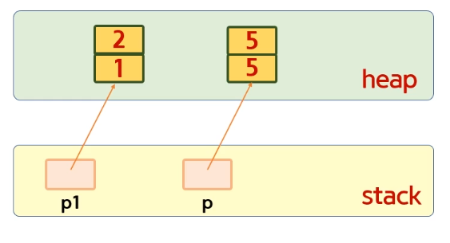
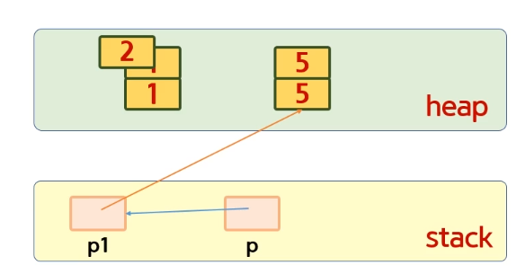

# 목차

1. [Value Type](#Value-Type)

   1-1.[Ref 전달 방식](#Ref-전달-방식)

   1-2.[Out 전달 방식](#Out-전달-방식)

2. [Ref Type](#Ref-Type)

<br>

# Value Type

## Ref 전달 방식

Value Type 변수(struct, int, ect..)는 stack에 저장된다.

하지만 변수로 저장하고 싶을 경우 `ref`를 붙이면 해당 주소를 참조하게 된다.

- ref

  C#에서는 Stack에 있는 주소값을 가르킬떄 해당을 쓸 수 있음

  Stack에 변수로 주소를 가르킴.

- 인자에 ref를 통해 Call By Ref를 구현 가능

  단 참조 전달시 메서드의 인자 둘다 ref를 붙여줘야 한다.

  ```C#
  using System;

  class Program
  {
      public static void inc1(int n)          // Call By Value
      {
          ++n;
      }
      public static void inc2(ref int n)      // Call By Ref
      {
          ++n;
      }

      public static void Main()
      {
          int n1 = 10;
          inc1(n1);
          Console.WriteLine(n1);          // 10 (Call By Value)

          int n2 = 10;
          inc2(ref n2);
          Console.WriteLine(n2);          // 11 (Call By Ref)
      }
  }
  ```

<br>

## Out 전달 방식

2개 이상의 결과 값을 반환하고 싶을 경우?

1. ref사용

   ```C#
   public static int prev_next_number1(int n, ref int r)
   {
       int a = r; // ok
       r = n + 1;
       return n - 1;
   }

    ~~~

    int result1 = prev_next_number1(n1, ref result2);

   ```

2. out사용

   ```C#
   public static int prev_next_number2(int n, out int r)
    {
        //int a = r; // error 읽기 안됨.
        r = n + 1;
        return n - 1;
    }

    ~~~

    int result1 = prev_next_number2(n1, out result2);

   ```

| 아무것도 없는 경우                     | ref                                  | out                                  |
| -------------------------------------- | ------------------------------------ | ------------------------------------ |
| 복사본 생성                            | Read / Write 모두 가능               | Write Only                           |
| 원본 변수에 접근 불가                  | 초기화 된 변수만 보낼 수 있다.       | 초기화 되지 않은 값도 가능           |
| 사이드 이팩트 주고 싶지 않을 경우 사용 | 변수의 값을 변경 하고 싶을 경우 사용 | 2개의 값을 반환하고 싶을때 주로 사용 |

<br>

# Ref Type

ref는 Value와 다르게 주소값을 가지고 있어서 수정할 경우 정상적으로 수정이 된다.

❌ 하지만 내부에서 새로운 객체에 할당해주면 원하는 대로 동작하지 않는다.

    ```C#
    public static void f1(Point p)      // Point p = p1
    {
        p.x = 2;                        // p1의 x는 2로 바뀜
        p = new Point(5, 5);
        // p가 가르키는 객체는 5가 되었으나 p1이 가르키는 곳은 그대로임
    }

    public static void Main()
    {
        Point p1 = new Point(1, 1);
        f1(p1);
        Console.WriteLine(p1.x);        //out 2
    }
    ```

- ref사용

  ref를 사용해서 해당 문제를 해결 핧 수 있다.

  💡 ref는 heap영역을 가르키는 것이 아닌 Stack영역을 가르킨다.

  ```C#
  public static void f2(ref Point p)  // ref Point p = refp1
  {
      p.x = 2;
      p = new Point(5, 5);
  }

  public static void Main()
  {
      Point p1 = new Point(1, 1);
      f2(ref p1);
      Console.WriteLine(p1.x);        //out 5, 성공적으로 바뀜
  }
  ```

Ref Type 을 전달 할때

|                           | 값전달 | ref |
| ------------------------- | ------ | --- |
| 상태 변경 여부            | ⭕     | ⭕  |
| 새로운 객체를 대치 하는것 | ❌     | ⭕  |

<br>

값을 그대로 전달 하는 경우 (f1)



ref를 사용한 경우 (f2)


