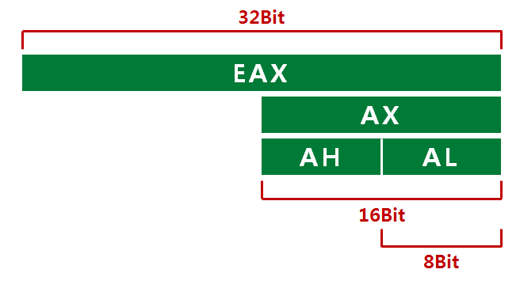
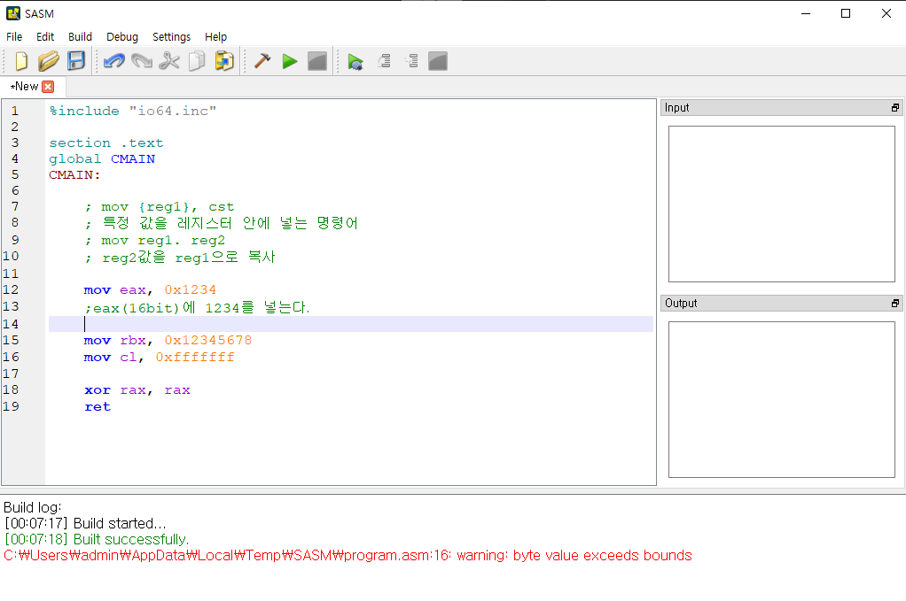
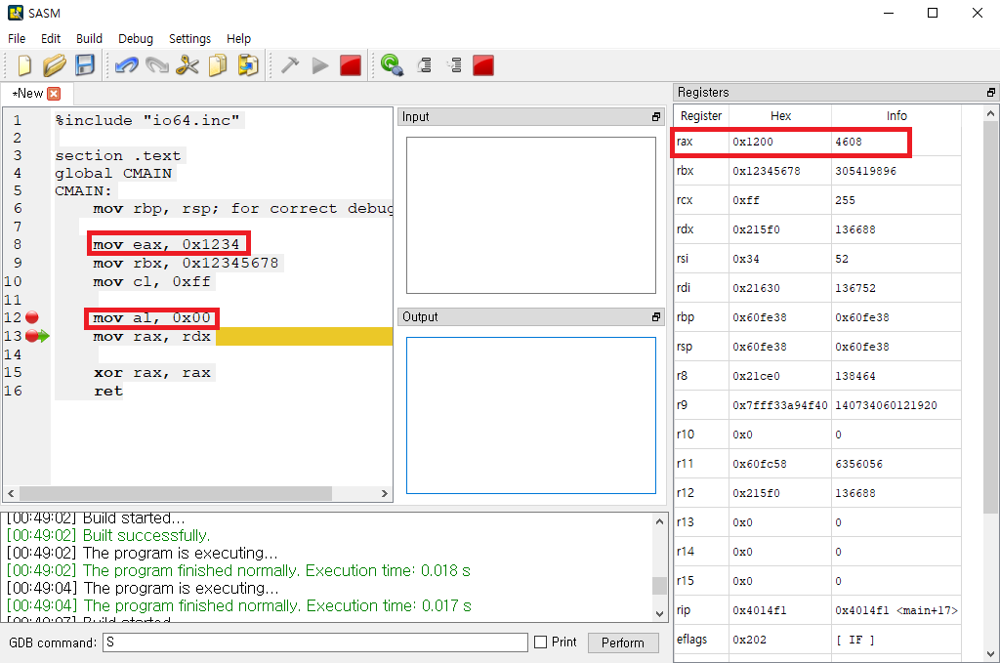

# 목차

1. [📌 어셈블러](#📌-어셈블러)
2. [📌 컴퓨터 구조](#📌-컴퓨터-구조)
3. [📌 프로세스 메모리 구조](#📌-프로세스-메모리-구조)
4. [📌 데이터 기초](#📌-데이터-기초)
5. [📌 레지스터](#📌-레지스터)
6. [📌 변수의 선언 및 사용](📌-변수의-선언-및-사용)

# 📌 어셈블러

프로그래밍 언어는 고급 언어에서 기계어로 변환하는 과정이 필요하다.

이 과정에서 어셈블리 언어가 필요한데 이 과정을 해주는 것이 컴파일러, 어셈블러 이다.


실행되는 코드이외에도 데이터나 여러 정보들이 있을 수 있는데, 작성한 SASM을 보면 그림과 같이 섹션이 나누어 진 것이 보인다.

```avrasm
%include "io64.inc"

section .text
global CMAIN
CMAIN:
  PRINT_STRING m

  xor rax, rax
  ret

section .data
   msg db "Hello World", 0x00
```


> 작성한 코드에서는 Section(".text")에 코드가 들어가고 Data즉 HelloWorld는 Section(".data")에 들어가게 된다.

<br>

# 📌 컴퓨터 구조


컴퓨터 구조의 핵심은 CPU, Main Memory(RAM), Hard Disk가 있는데, Ram은 휘발성, Disk는 비 휘발성인 특징이 있고, 속도는 Ram이 하드 디스크 보다 빠르다.

일반적으로 데이터를 Disk -> Ram -> CPU로 올리기 떄문에 속도는 CPU에 가까울수록 빠르다.

CPU에서는 연산(실행)이 이루어 진다

> RAM에 올라간 프로그램은 작업 관리자 창에서 볼 수 있음.

<br>

# 📌 프로세스 메모리 구조


위와 같이 코드, 데이터, 힙, 스택으로 구분되어 있으며 힙은 아래로 스택은 위로 확장하는 구조를 가진다.

> 힙이나 스택이 가득차서 다른 영역을 침범하는 경우 큰 손실을 일의킬 수 있음.

<br>

# 📌 데이터 기초

Q) 데이터 저장은 어떻게 하나?

A) 비트와 바이트를 통해 구현한다.

    비트는 기초적인 데이터 단위를 의미하고
    8개의 비트로 이루어진 데이터의 양을 바이트라고 한다.

데이터의 표현

1.  데이터가 표현할 수 있는 크기를 선택

2.  해당 데이터의 비트값을 키고 끄는것으로 표현한다.

    - 데이터의 음수 양수 표현을 알아야 한다.

            양수의 표현 우리가 알던 2^자리수 로 표기함
            음의 수는 보수를 취해주어 계산한다.
            일반적으로 데이터 표현시 첫번째 비트는 부호비트이다.
            EX) 1000 0000 => -128
                0100 0000 => 64

    - 2진(바이너리 : BIN) 데이터는 일반적으로 0b를 앞에 붙여 표현한다.

      EX) 0b1(1), 0b11(3)

    - 16진(핵사 : HEX) 데이터는 일반적으로 0x를 앞에 붙여 표현한다.

      EX) 0x1(1), 0x11(19)

진법 표현은 계산기 앱으로도 쉽게 구할 수 있음


<br>

# 📌 레지스터

어셈블리 프로그래밍에서는 CPU, 레지스터, 메모리가 핵심 역활을 하게 되는데, 메모리에서 레지스터로 올라가는 과정을 살펴본다.

    2^6(64) bit = 2^3(8) byte = 2^2 (4) word = 2 dword(Double-Word) = 1 qword(quad-word)

Q) 레지스터를 사용하는 이유

A) CPU가 연산을 한 내용을 임시적으로 저장하기 위한 용도.

    메인 메모리는 접근하기에 시간이 많이 걸리므로 레지스터를 CPU안에 넣어서 계산값을 저장함.

레지스터는 여러 종류가 있다.
각각의 크기에 맞게 사용하게 되는데

1. rax 64 bit(전체)를 사용
2. eax 32 bit(절반)를 사용
3. ax 16 bit(1/4)를 사용
4. ah,al 8 bit (15/16)를 사용

> 범용 레지스터는 rax ~ rdx까지 있다 [참조](https://peemangit.tistory.com/37)<br>
> 그림에서는 나오지 않았으나 64 bit 운영체제일 경우 rax 까지 확장됨



```avrasm
mov {reg1}, cst
```

- 특정 값을 레지스터 안에 넣는 명령어

```avrasm
mov reg1. reg2
```

- reg2값을 reg1으로 복사

EX)



> 💡 cl은 최하위 8bit를 사용하는데 너무 큰 값이 들어가서 에러가 뜸

디버깅을 사용하면 해당 레지스터를 변경하는 것을 쉽게 볼 수 있음

    레지스터 값은 SASM기준으로 디버그에서 Show Register을 키면 볼 수 있다



12번째 라인에서 eax(4바이트)에 들어있는 0x1234에 al(2바이트)인 00을 넣어 al을 0으로 만든 것을 볼 수 있다.

- 0x1234 (4byte) 에서 0x00이 아닌 0x1200으로 변함을 볼 수 있다.

<br>

# 📌 변수의 선언 및 사용

초기화 된 데이터를 사용할 경우 data 영역에 들어감

    {변수이름} {크기} {초기값}
    크기 명령어(byte) => db(1) dw(2) dd(4) dq(8)
    즉 4바이트 받고싶으면 dd
    ex) Data dw 0x00 = Data라는 변수에 2바이트, 00으로 초기화

초기화 되지 않은 데이터를 사용할 경우 bss영역에 들어감

    {변수이름} {크기} {개수}
    크기 명령어(byte) => resb(1) resw(2) resd(4) resq(8)
    ex) Data resb 10 = Data라는 4바이트 변수를 10개 생성

<br>

> Q) 두가지 영역을 나눈 이유 <br>
> A) 초기화 되지 않은 데이터들은 기본 값으로 세팅이 되므로, 크기만 알 고 있으면 파일의 크기를 줄일 수 있음.

<br>


<br>

```avrasm
section .data
    a db 0x11   ; [0x11]
    b dw 0x2222
    c dd 0x33333333
    d dq 0x4444444444444444

section .bss
    e resb 10
```

<br>

해당 코드의 데이터 출력시 a~d까지 연속된 데이터를 할당함을 볼 수 있다.

Why) 데이터 영역에 연속된 공간에 할당했기 때문

<br>

> Q) e는 왜 연속된 공간이 아니냐<br>
> A) e는 해당 공간이 아닌 bss에 선언했기 떄문.

<br>


<br>

```avrasm
section .text
global CMAIN
CMAIN:

  ; 변수를 메모리에 할당
  mov rax, a
  ; 이때 주소값으로 전달해준다. 즉 콜바이 벨류가 아닌 레퍼
  ret
```

<br>

위 코드를 실행 시킬 경우 rax 는 a의 값인 0x11이 아닌 0x403010을 저장함을 볼 수 있다.

이는 값인 0x11이 아닌 a메모리 주소인 0x403010임을 알 수 있다.

또한 a메모리 주소에 1바이트를 더한 0x403011은 b의 주소를 볼 수 있다. 이는 메모리가 연속적으로 할당 되었다는 사실을 알 수 있다.

<br>


> Q) 왜 벨류가 아닌 레퍼를 주소로 주나 <br>
> A) 변수는 "바뀔 수 있는 수" 이기 떄문에 벨류가 아닌 레퍼를 주어서 바뀌는지 알 수 있어야 한다.<br>
> 💡 벨류를 참고하고 싶으면 []로 감싸야 한다.

<br>

```avrasm
%include "io64.inc"

section .text
global CMAIN
CMAIN:
    mov rbp, rsp; for correct debugging
    mov rax, 0x12345678

    ; 변수를 메모리에 할당
    ;mov rax, a
    ; 이때 주소값으로 전달해준다. 즉 콜바이 벨류가 아닌 레퍼
    ; mov rax, [a]
    ; []를 넣어주면 해당 데이터의 벨류를 가지고 온다.
    ; 하지만 크기를 지정하지 않았으므로 rax의 크기 만큼 꺼내옴

    mov al, [a]
    ; al (1 Byte)만 꺼내온다. 이렇게 하면 위에서 12345678으로 되어있는 값에서 12345611로 변함을 볼 수 있다.
        ret

    ; ex) Data dw 0x00

section .data
    a db 0x11   ; [0x11]
    b dw 0x2222
    c dd 0x33333333
    d dq 0x4444444444444444

section .bss
    e resb 10
```


반대로 값을 메모리에 넣을 수 있다.

```avrasm
%include "io64.inc"

section .text
global CMAIN
CMAIN:
    mov rbp, rsp; for correct debugging
    ...
    mov [a], cl         ; 공간을 변수에 할당
    mov [a], byte 0x99  ; 상수를 변수에 할당

        ret
```

> 💡 상수를 메모리에 넣을때, 크기를 지정해주는 것이 필수


<br>

> Q) a의 크기(1byte) 보다 큰 word(2byte)를 할당하면 어떻게 될까<br>
> A) 해당 값을 넘어서 다른 변수의 메모리도 바꾼다. (Overr Flow)


