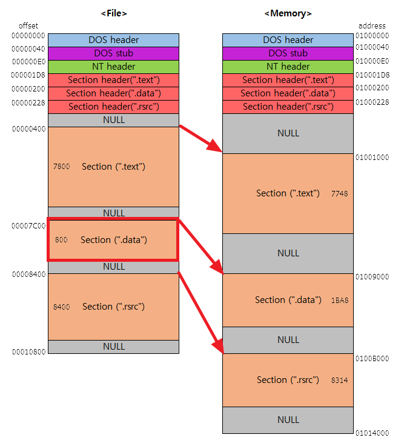
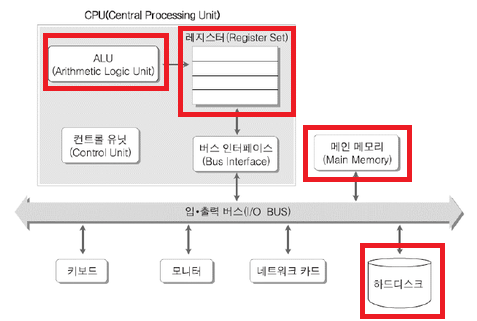
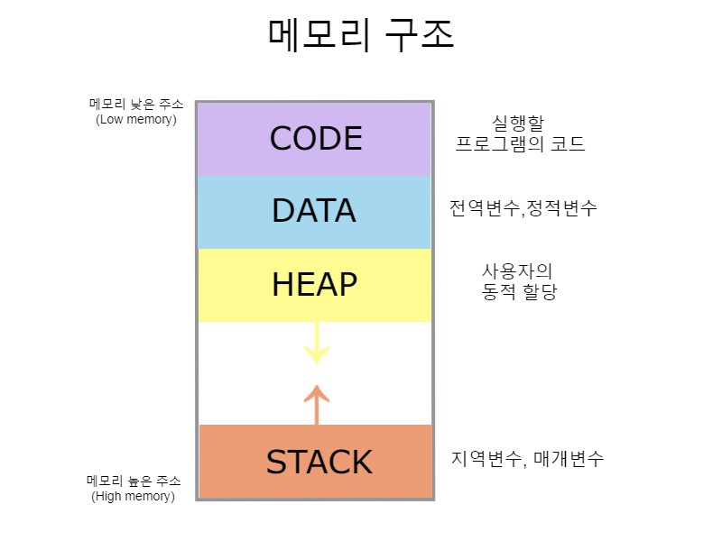

# 📌 어셈블러

프로그래밍 언어는 고급 언어에서 기계어로 변환하는 과정이 필요하다.

이 과정에서 어셈블리 언어가 필요한데 이 과정을 해주는 것이 컴파일러, 어셈블러 이다.

실행되는 코드이외에도 데이터나 여러 정보들이 있을 수 있는데, 작성한 SASM을 보면 그림과 같이 섹션이 나누어 진 것이 보인다.

    %include "io64.inc"

    section .text
    global CMAIN
    CMAIN:
      PRINT_STRING msg

      xor rax, rax
      ret

    section .data
       msg db "Hello World", 0x00

> 작성한 코드에서는 Section(".text")에 코드가 들어가고 Data즉 HelloWorld는 Section(".data")에 들어가게 된다.

# 📌 컴퓨터 구조

컴퓨터 구조의 핵심은 CPU, Main Memory(RAM), Hard Disk가 있는데, Ram은 휘발성, Disk는 비 휘발성인 특징이 있고, 속도는 Ram이 하드 디스크 보다 빠르다.

일반적으로 데이터를 Disk -> Ram -> CPU로 올리기 떄문에 속도는 CPU에 가까울수록 빠르다.

CPU에서는 연산(실행)이 이루어 진다

> RAM에 올라간 프로그램은 작업 관리자 창에서 볼 수 있음.

# 📌 프로세스 메모리 구조

위와 같이 코드, 데이터, 힙, 스택으로 구분되어 있으며 힙은 아래로 스택은 위로 확장하는 구조를 가진다.

> 힙이나 스택이 가득차서 다른 영역을 침범하는 경우 큰 손실을 일의킬 수 있음.

# 📌 데이터 기초

Q) 데이터 저장은 어떻게 하나?

A) 비트와 바이트를 통해 구현한다.

    비트는 기초적인 데이터 단위를 의미하고
    8개의 비트로 이루어진 데이터의 양을 바이트라고 한다.

데이터의 표현

1.  데이터가 표현할 수 있는 크기를 선택

2.  해당 데이터의 비트값을 키고 끄는것으로 표현한다.

    - 데이터의 음수 양수 표현을 알아야 한다.

            양수의 표현 우리가 알던 2^자리수 로 표기함
            음의 수는 보수를 취해주어 계산한다.
            일반적으로 데이터 표현시 첫번째 비트는 부호비트이다.
            EX) 1000 0000 => -128
                0100 0000 => 64

    - 2진(바이너리 : BIN) 데이터는 일반적으로 0b를 앞에 붙여 표현한다.

      EX) 0b1(1), 0b11(3)

    - 16진(핵사 : HEX) 데이터는 일반적으로 0x를 앞에 붙여 표현한다.

      EX) 0x1(1), 0x11(19)

진법 표현은 계산기 앱으로도 쉽게 구할 수 있음

